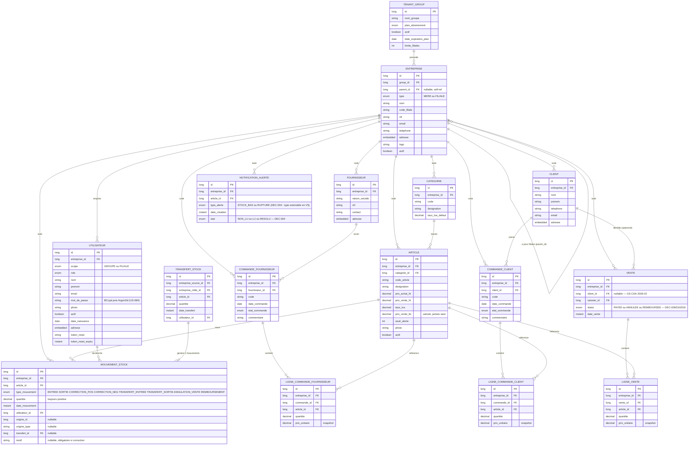

# Modèle de Données — StockMaster CM
### Référence : GS-DATA-2026-01 | Version : 1.0 | Date : Juillet 2026 | Statut : Proposé
### Documents parents : GS-CDA-2026-01 §6, GS-CDA-2026-02 (addendum), CDCT_StockMaster_CM sections 22-30

---

## Objet

Ce document extrait, formalise et rend **versionnable indépendamment** le modèle de données défini dans GS-CDA-2026-01 §6. Il devient la **source de vérité unique** pour le schéma logique (MLD) de StockMaster CM.

**Pourquoi un fichier séparé :** le modèle de données évolue à un rythme différent de l'analyse fonctionnelle (ex. GS-CDA-2026-02 a modifié `Vente` sans toucher au reste de l'analyse). Le maintenir noyé dans un document de 30+ sections crée un risque de désynchronisation avec le schéma Flyway réel (`V1__init_schema.sql`, `V2__create_indexes.sql`). Ce fichier doit être mis à jour **dans la même PR** que toute migration Flyway modifiant le schéma — même règle que `test_postman.md` vis-à-vis de l'API.

**Convention :** ce document reflète l'état validé après GS-CDA-2026-02. Toute divergence avec les migrations Flyway réellement appliquées en base est un bug de documentation à corriger immédiatement.

---

## 1. Diagramme Entité-Relation complet

> ⚠️ **Note de synchronisation :** ce fichier est une **vue dérivée** — l'autorité est le référentiel `GS-REF-2026-01` (parties 4, 5, 6 du `document/referentiel/`) et les migrations Flyway. `VENTE.statut` = `PAYEE`/`ANNULEE`/`REMBOURSEE` (`DEC-006`, `DEC-010`, `DEC-018`) ; la vente directe **bloque** en 409 sur stock insuffisant (`DEC-023`/`DEC-017`) ; le type d'alerte `ECART_STOCK_DETECTE` est **supprimé** (`DEC-037`). Si ce diagramme diverge des migrations réelles, **ce fichier a tort** — corriger contre le schéma Flyway, jamais l'inverse.

---

## 2. Règles d'intégrité référentielle (rappel normatif, source : GS-CDA-2026-01 §6.4)

| Entité | Règle | Enforcement |
|---|---|---|
| `Article` | Non supprimable si référencé dans `LigneCommandeFournisseur`, `LigneCommandeClient` ou `LigneVente` | Vérification service, pas seulement FK BDD (message explicite) |
| `Categorie` | Non supprimable si articles actifs rattachés | Idem |
| `Client` | Non supprimable si `CommandeClient` associées | Idem |
| `Fournisseur` | Non supprimable si `CommandeFournisseur` associées | Idem |
| `Entreprise` (filiale) | Non supprimable si articles, mouvements ou commandes existants | Idem |
| `CommandeFournisseur`/`CommandeClient` VALIDEE/LIVREE | Modification interdite — état verrouillé | Vérification état avant toute mutation |
| `MouvementStock` | Aucune modification/suppression, jamais | Pas d'endpoint PUT/DELETE exposé, pas de repository method |
| `Vente` ANNULEE | Ne modifie jamais les mouvements existants — génère un mouvement `ANNULATION_VENTE` compensatoire | GS-CDA-2026-02 |

---

## 3. Index critiques (extrait CDCT §23, pour lecture rapide sans ouvrir le CDCT)

| Table | Index | Justification |
|---|---|---|
| `mouvement_stock` | `(entreprise_id, article_id)` composite | Requête de calcul du stock réel — exécutée à chaque consultation d'article |
| `article` | `(entreprise_id, code_article)` unique | Contrainte d'unicité par entreprise + recherche fréquente |
| `utilisateur` | `(entreprise_id, email)` unique | Contrainte d'unicité par entreprise |
| `commande_fournisseur` / `commande_client` | `(entreprise_id, etat_commande)` | Filtrage des listes par état — pagination fréquente |
| `entreprise` | `(group_id)` | Requêtes de consolidation Admin Groupe |
| `entreprise` | `(parent_id)` | Résolution des filiales d'une maison mère |

---

## 4. Isolation multi-tenant — application au niveau modèle

Toute table métier porte une colonne `entreprise_id` **non nullable**, sauf `tenant_group` (racine) et `entreprise` elle-même (qui porte `group_id`). Aucune requête de repository ne doit omettre le filtre `entreprise_id` (ou `group_id` pour les vues consolidées Admin Groupe) — voir GS-CDA-2026-01 §8.6, règle de sécurité la plus critique du système.

**Recommandation d'implémentation :** un filtre Hibernate (`@Filter` / `@FilterDef`) activé systématiquement via un intercepteur de session sur `entreprise_id` réduirait le risque d'oubli manuel par rapport à une clause `WHERE` répétée dans chaque méthode de repository. À évaluer en Sprint 1 si non déjà tranché dans le CDCT.

---

## 5. Historique des changements

| Version | Date | Changement | Source |
|---|---|---|---|
| 1.0 | Juillet 2026 | Extraction initiale depuis GS-CDA-2026-01 §6, intégration des changements `Vente` de GS-CDA-2026-02 | GS-DATA-2026-01 |

---

> **Règle de maintenance :** toute PR modifiant `V*__*.sql` (Flyway) doit inclure la mise à jour de ce fichier. Un reviewer doit rejeter toute PR de migration de schéma sans mise à jour correspondante de `GS-DATA-2026-01`.
