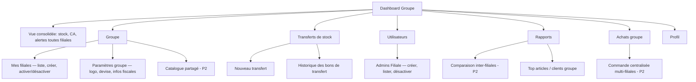
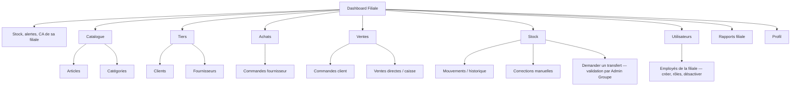
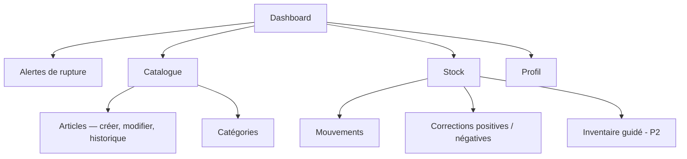
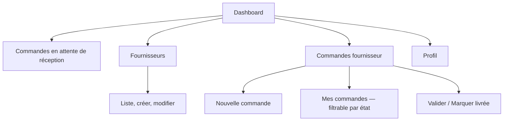
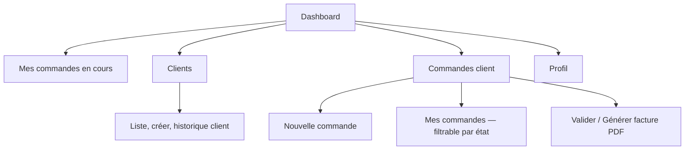
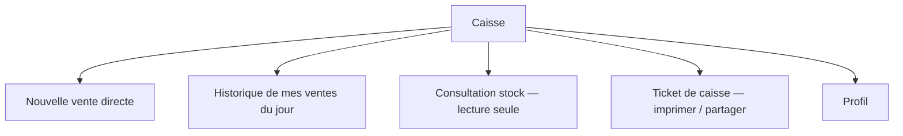
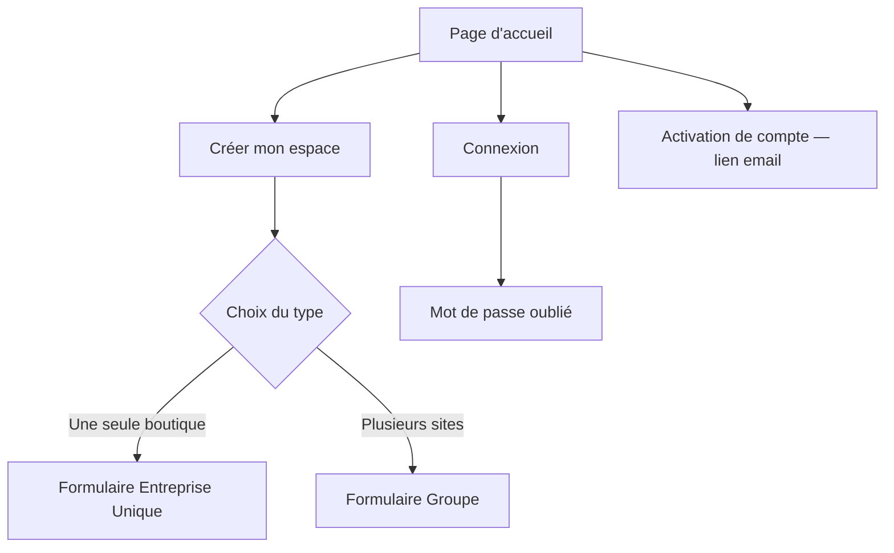
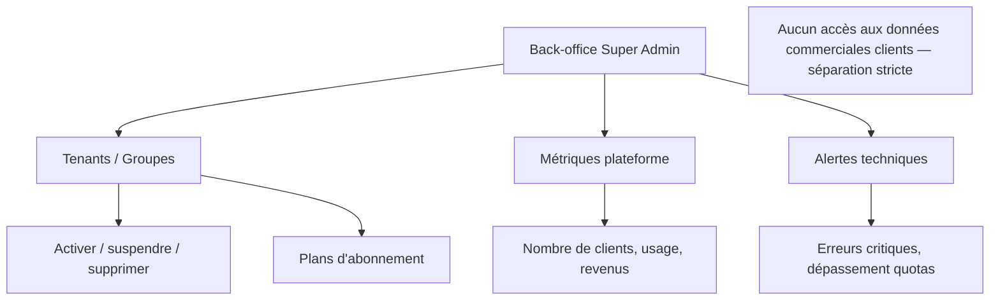

# Architecture de l'Information — StockMaster CM
### Référence : GS-IA-2026-01 | Version : 1.0 | Date : Juillet 2026 | Statut : Proposé
### Document parent : GS-CDA-2026-01 §2 (acteurs), §7.3 (visibilité par rôle)

> ⚠️ **Statut d'implémentation :** ce document décrit l'architecture **cible**. Seuls `stockmaster-shared`, `stockmaster-auth` et `stockmaster-bootstrap` contiennent du code réel à ce jour — tous les autres modules référencés ici (`groupe`, `utilisateur`, `catalogue`, `tiers`, `achat`, `stock`, `vente`, `notification`, `reporting`) sont des stubs vides (arborescence de packages sans classes). Voir `knowledge.md` et `document/03-pilotage/progress-ledger.md` pour l'état réel.

---

## Objet

GS-CDA-2026-01 décrit **ce que** chaque rôle peut faire (§2, §3) mais aucun document ne formalise **comment le menu/la navigation** traduit ce périmètre à l'écran. Ce document comble ce trou : une arborescence de navigation par rôle, directement dérivée de la matrice de visibilité §7.3 et des EPICs du backlog. Elle sert de spécification d'entrée pour le design (maquettes) et pour le développement frontend (routing, guards).

**Principe directeur :** un rôle ne doit jamais voir dans son menu une section à laquelle il n'a pas accès en API — la navigation est un **reflet strict** du RBAC backend, jamais une source de vérité indépendante.

---

## 1. Arborescence — Admin Groupe

## 2. Arborescence — Admin Filiale

## 3. Arborescence — Employé : Gestionnaire Stock

## 4. Arborescence — Employé : Responsable Achats

## 5. Arborescence — Employé : Commercial

## 6. Arborescence — Employé : Caissier / Vendeur

## 7. Espace public (non authentifié)

## 8. Espace Super Admin (back-office séparé — sous-domaine distinct)

---

## 9. Règle de garde (frontend) dérivée de cette arborescence

| Élément UI | Condition d'affichage | Source de vérité backend |
|---|---|---|
| Section "Mes filiales" | `role == ADMIN_GROUPE` | `@PreAuthorize("hasRole('ADMIN_GROUPE')")` sur `GroupeController` |
| Section "Transferts" (déclencher) | `role == ADMIN_GROUPE` | idem, endpoint `POST /transferts` |
| Section "Transferts" (demander) | `role == ADMIN_FILIALE` | endpoint dédié à la demande (à confirmer en implémentation) |
| Bouton "Facture PDF" | `role in (COMMERCIAL, ADMIN_*)` | endpoint `GET /commandes-client/{id}/facture` |
| Menu "Utilisateurs" | `role in (ADMIN_GROUPE, ADMIN_FILIALE)` | `UtilisateurController` RBAC |
| Toute section catalogue/stock/tiers | `entreprise_id` de l'utilisateur connecté | filtre isolation multi-tenant (§8.6 GS-CDA-2026-01) — **jamais géré côté frontend seul** |

> ⚠️ **Rappel de sécurité :** cette arborescence organise l'expérience utilisateur — elle ne remplace **jamais** le contrôle d'accès serveur. Masquer un menu côté frontend sans `@PreAuthorize` correspondant côté backend est une faille, pas une fonctionnalité.

---

## 10. Prochaines étapes

- Faire valider cette arborescence par un designer avant production des maquettes (GS-DESIGN-BACKLOG-2026-01).
- Ajouter la navigation mobile si une interface responsive distincte (pas juste adaptive) est prévue — GS-CDA-2026-01 §1.4 signale l'accès mobile comme dominant au Cameroun.
