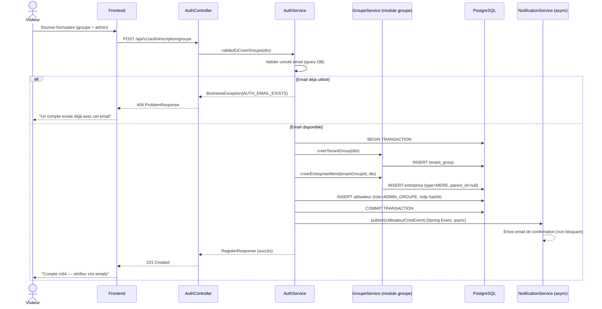
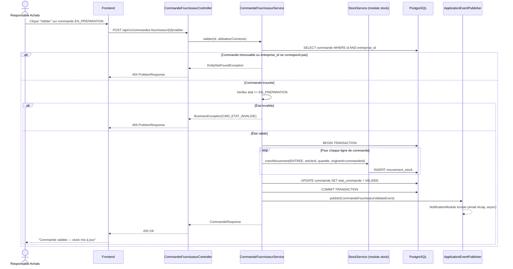
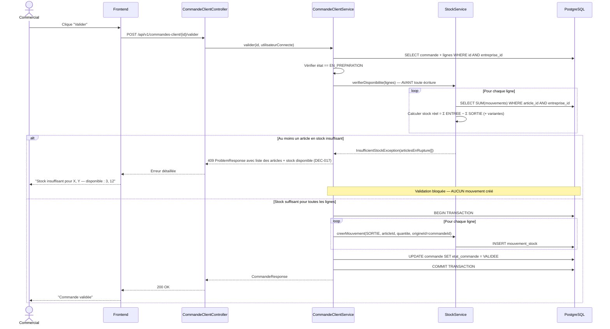
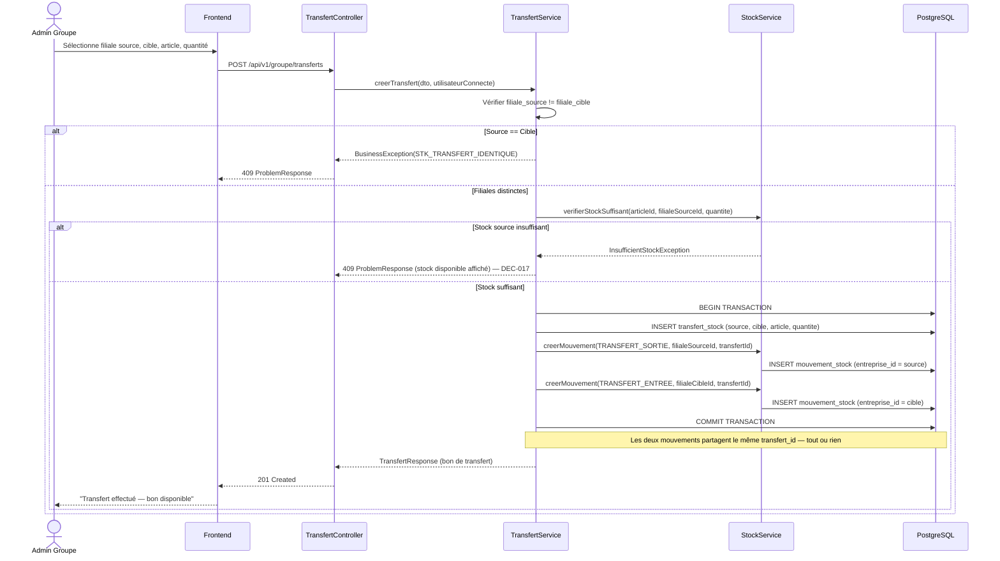
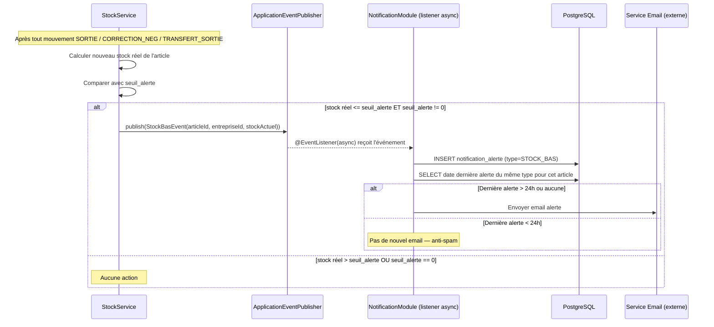

# Diagrammes de Séquence — StockMaster CM
### Référence : GS-SEQ-2026-01 | Version : 1.0 | Date : Juillet 2026 | Statut : Proposé
### Documents parents : GS-CDA-2026-01 §4 (flows en prose), GS-BACKLOG-2026-01 (endpoints)

> ⚠️ **Statut d'implémentation :** ce document décrit l'architecture **cible**. Seuls `stockmaster-shared`, `stockmaster-auth` et `stockmaster-bootstrap` contiennent du code réel à ce jour — tous les autres modules référencés ici (`groupe`, `utilisateur`, `catalogue`, `tiers`, `achat`, `stock`, `vente`, `notification`, `reporting`) sont des stubs vides (arborescence de packages sans classes). Voir `knowledge.md` et `document/03-pilotage/progress-ledger.md` pour l'état réel.

---

## Objet

GS-CDA-2026-01 §4 décrit les 8 flows métier en prose/ASCII. Ce niveau était suffisant pour un backend développé en solo. Ce document formalise les flows **les plus critiques** (ceux impliquant plusieurs couches : Frontend → API → Service → Repository → BDD, ou plusieurs modules internes via événements Spring) en diagrammes de séquence Mermaid, pour :

- Donner un contrat visuel exploitable par une équipe frontend externe.
- Clarifier les frontières entre modules (Spring Modulith) au moment où un événement inter-module est déclenché plutôt qu'un appel direct.
- Servir de support de revue technique (architecture) et de testing (QA peut dériver des cas de test directement de la séquence).

**Portée :** les flows représentés ici sont ceux qui génèrent des mouvements de stock automatiques (les plus sensibles) et le flow d'inscription (le plus complexe transactionnellement). Les flows CRUD simples (créer un article, un client) ne nécessitent pas de diagramme de séquence — un contrat d'endpoint (backlog) suffit.

---

## 1. Inscription — Groupe multi-sites (UC-01)

**Points de contrôle QA dérivés :**
- Rollback complet vérifié si l'INSERT `utilisateur` échoue après l'INSERT `entreprise` (transaction atomique — voir UC-01 "Règle métier").
- L'échec d'envoi d'email ne doit **jamais** annuler la transaction BDD déjà commitée (événement async, découplé).

---

## 2. Validation d'une commande fournisseur (UC-02)

**Points de contrôle QA dérivés :**
- Tous les mouvements sont créés dans la **même transaction** que le changement d'état — aucun mouvement orphelin possible en cas d'échec partiel.
- Test de concurrence : deux validations simultanées de la même commande ne doivent produire les mouvements qu'une seule fois (verrouillage optimiste ou pessimiste à spécifier — voir action de suivi §3).

---

## 3. Validation d'une commande client — avec vérification de stock bloquante (UC-03)

**Points de contrôle QA dérivés :**
- La vérification de disponibilité doit couvrir **la totalité des lignes** avant la moindre écriture (pas de validation partielle ligne par ligne).
- Race condition à tester explicitement : deux commandes concurrentes consommant le même stock limité — le second thread doit voir le stock déjà décrémenté par le premier (lecture cohérente au sein de la transaction, niveau d'isolation à documenter dans le CDCT si pas déjà fait).

---

## 4. Transfert inter-filiales — double mouvement atomique (UC-05)

---

## 5. Alerte de stock critique — flow événementiel asynchrone (§7.4 GS-CDA-2026-01)

**Point d'architecture confirmé :** ce flow doit rester **découplé du chemin transactionnel principal** (publication d'événement Spring, écouteur `@Async` ou `@TransactionalEventListener(phase = AFTER_COMMIT)`) — une panne du service de notification ne doit jamais faire échouer une vente ou une commande.

---

## 6. Prochaines étapes

- Compléter avec le flow **Vente Directe non bloquante** (comportement révisé par GS-CDA-2026-02 — vente autorisée même en cas de stock insuffisant, à la différence de CommandeClient) dès que le comportement exact de compensation (`ANNULATION_VENTE`) est stabilisé en implémentation.
- Ajouter le flow d'**annulation de vente** une fois US-067 (revue) livrée.
- Si un frontend externe rejoint le projet, ce fichier devient le contrat de référence à valider avec l'équipe frontend avant tout développement d'écran impliquant plusieurs appels API séquencés.
