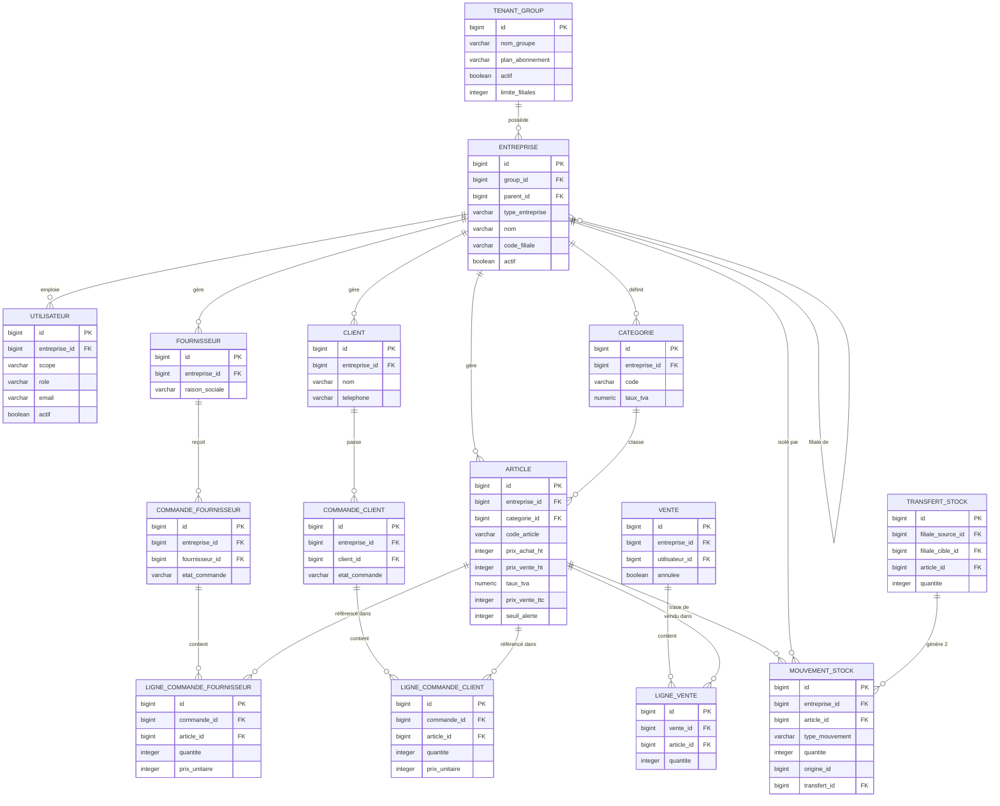
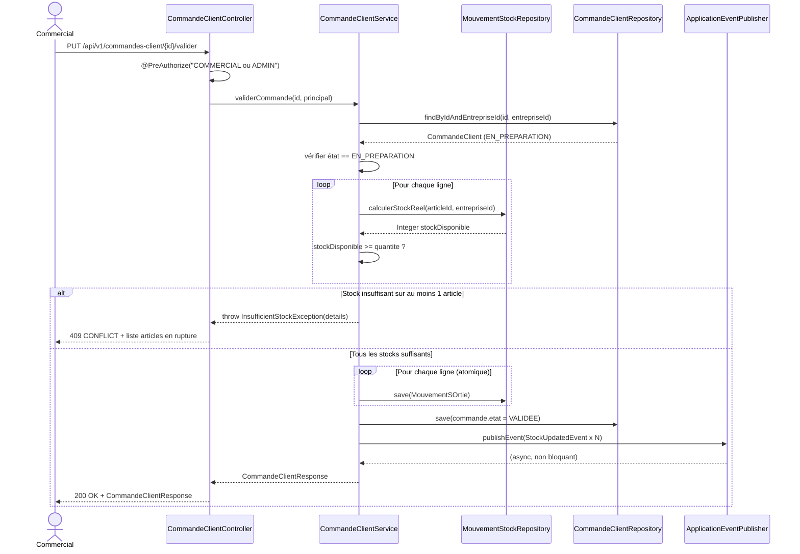
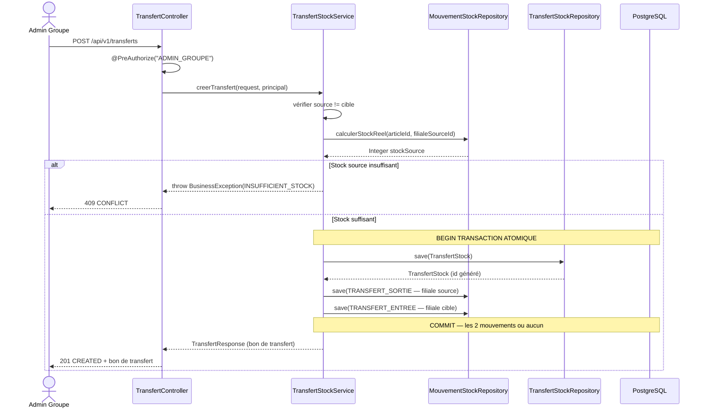

---

## 22. Monolithe Modulaire — Architecture détaillée

### 22.1 Définition et justification

Un **monolithe modulaire** est une application déployée comme un seul artefact (JAR unique),
mais dont le code source est découpé en **modules fonctionnels internes fortement cohésifs
et faiblement couplés**, avec des frontières de domaine respectées au niveau du code.

Ce n'est ni un monolithe spaghetti (tout dans un seul package), ni des microservices
(déploiements séparés). C'est la **troisième voie** : les bénéfices de l'isolation
du domaine sans la complexité opérationnelle des microservices.

```
Monolithe spaghetti     Monolithe modulaire          Microservices
       ❌                       ✅                         ⚠️
  Tout mélangé           Modules isolés             Services séparés
  Impossible à           Un seul déploiement        N déploiements
  maintenir              Évolutif en microservices  Complexité réseau
```

### 22.2 Règles de modularité interne

Chaque module DOIT respecter les règles suivantes :

| Règle | Description | Vérification |
|---|---|---|
| **Isolation de package** | Un module n'importe jamais directement une classe interne d'un autre module | Revue de code + ArchUnit |
| **Interface de communication** | Les modules communiquent via des interfaces de service (`@Service`) exposées, jamais via les repositories d'un autre module | ArchUnit |
| **Indépendance des entités** | Chaque module définit ses propres entités JPA. Pas de `@ManyToOne` cross-module. Les références cross-module utilisent des IDs (Long), pas des objets | Convention |
| **Événements pour le découplage** | Un module notifie un autre via Spring Application Events, jamais par appel direct de service | Conception |

### 22.3 Structure des packages — règle d'or

```
com.stockmaster.{module}/
├── controller/     ← Entrée HTTP. Dépend de : service/ (interface)
├── service/
│   ├── {Nom}Service.java         ← Interface publique du module
│   └── impl/
│       └── {Nom}ServiceImpl.java ← Implémentation interne
├── repository/     ← Accès données. Dépend de : domain/
├── domain/
│   ├── entity/     ← Entités JPA
│   └── enums/      ← Enums métier du module
├── dto/
│   ├── request/    ← DTOs entrants (validation Jakarta)
│   └── response/   ← DTOs sortants (immuables, Records)
├── mapper/         ← MapStruct. Dépend de : domain/, dto/
└── event/          ← Events Spring pour communication inter-modules
```

**Dépendances autorisées entre modules :**

```
stock/service  → catalogue/service   (pour lire un article)
commande/service → stock/service     (pour créer un mouvement)
commande/service → tiers/service     (pour vérifier client/fournisseur)
notification/service ← stock/event   (abonné aux événements stock)

❌ INTERDIT
commande/repository → stock/repository    (accès direct cross-module)
notification/service → commande/domain    (import d'entité étrangère)
```

### 22.4 Communication inter-modules par événements

```java
// Module stock — publie un événement après mouvement
// stock/event/StockUpdatedEvent.java
public record StockUpdatedEvent(
    Long articleId,
    Long entrepriseId,
    Integer nouveauStock,
    TypeMouvement typeMouvement,
    Instant timestamp
) {}

// stock/service/impl/StockServiceImpl.java
@Service
@RequiredArgsConstructor
@Slf4j
public class StockServiceImpl implements StockService {

    private final ApplicationEventPublisher eventPublisher;
    private final MouvementStockRepository mouvementRepository;
    private final ArticleRepository articleRepository;

    @Override
    @Transactional(rollbackFor = Exception.class)
    public MouvementStock creerMouvement(CreerMouvementCommand cmd) {
        MouvementStock mouvement = mouvementFactory.build(cmd);
        MouvementStock saved = mouvementRepository.save(mouvement);

        Integer nouveauStock = articleRepository
            .calculerStockReel(cmd.articleId(), cmd.entrepriseId());

        // Publication APRÈS commit — l'événement est déclenché une fois la transaction réussie
        eventPublisher.publishEvent(new StockUpdatedEvent(
            cmd.articleId(), cmd.entrepriseId(),
            nouveauStock, cmd.type(), Instant.now()
        ));

        return saved;
    }
}

// Module notification — abonné à l'événement
// notification/service/AlerteStockListener.java
@Component
@RequiredArgsConstructor
@Slf4j
public class AlerteStockListener {

    private final AlerteService alerteService;

    @EventListener
    @Async("taskExecutor")  // Exécution asynchrone — ne bloque pas la transaction principale
    @Transactional(propagation = Propagation.REQUIRES_NEW) // Transaction indépendante
    public void onStockUpdated(StockUpdatedEvent event) {
        log.debug("Événement stock reçu — article {} nouveau stock {}",
                  event.articleId(), event.nouveauStock());
        alerteService.verifierEtCreerAlerte(event);
    }
}
```

### 22.5 Enforcement avec ArchUnit

ArchUnit permet de vérifier les règles architecturales **automatiquement dans les tests**.

```java
@AnalyzeClasses(packages = "com.stockmaster")
class ArchitectureTest {

    @ArchTest
    static final ArchRule couches_respectees = layeredArchitecture()
        .consideringAllDependencies()
        .layer("Controller").definedBy("..controller..")
        .layer("Service").definedBy("..service..")
        .layer("Repository").definedBy("..repository..")
        .layer("Domain").definedBy("..domain..")
        .whereLayer("Controller").mayOnlyBeAccessedByLayers("Controller")
        .whereLayer("Service").mayOnlyBeAccessedByLayers("Controller", "Service")
        .whereLayer("Repository").mayOnlyBeAccessedByLayers("Service")
        .whereLayer("Domain").mayOnlyBeAccessedByLayers("Controller", "Service", "Repository");

    @ArchTest
    static final ArchRule controllers_ne_dependent_pas_des_repositories =
        noClasses().that().resideInAPackage("..controller..")
            .should().dependOnClassesThat()
            .resideInAPackage("..repository..");

    @ArchTest
    static final ArchRule modules_isoles =
        noClasses().that().resideInAPackage("com.stockmaster.commande..")
            .should().dependOnClassesThat()
            .resideInAPackage("com.stockmaster.stock.repository..");

    @ArchTest
    static final ArchRule services_ont_interface =
        classes().that().resideInAPackage("..service.impl..")
            .and().haveNameEndingWith("ServiceImpl")
            .should().implement(JavaClass.Predicates.assignableTo(
                Object.class)); // remplacer par l'interface correcte selon le contexte
}
```

---

## 23. Flyway — Gestion des migrations de base de données

### 23.1 Principes fondamentaux

Flyway est le **seul mécanisme autorisé** pour modifier le schéma de base de données
en environnement de test, de staging et de production.

```
RÈGLE ABSOLUE : spring.jpa.hibernate.ddl-auto=none en tout environnement non-local.
En local uniquement : ddl-auto=validate (pour détecter les divergences, jamais update).
```

| Environnement | ddl-auto | Flyway |
|---|---|---|
| `local` (développeur) | `validate` | `enabled: true` — migrations appliquées au démarrage |
| `test` (CI) | `none` | `enabled: true` — migrations appliquées avant les tests |
| `staging` | `none` | `enabled: true` — migrations appliquées au déploiement |
| `prod` | `none` | `enabled: true` — migrations appliquées au déploiement |

### 23.2 Convention de nommage des scripts

```
V{version}__{description_snake_case}.sql

Exemples :
V1__init_schema.sql
V2__create_indexes.sql
V3__add_articles_table.sql
V4__add_seuil_alerte_to_article.sql
V5__create_transfert_stock_table.sql
V20260610__add_full_text_search_index.sql

Règles :
- Deux underscores (__) entre version et description
- Description en snake_case, lisible par un humain
- Version numérique croissante et UNIQUE — jamais réutiliser un numéro
- Scripts JAMAIS modifiés après exécution (Flyway checksum)
- Pour corriger un script exécuté : créer un nouveau script Vn__fix_...
```

### 23.3 Scripts de migration complets

```sql
-- V1__init_schema.sql
-- Schéma initial complet — Tables principales

CREATE TABLE tenant_group (
    id                    BIGSERIAL PRIMARY KEY,
    nom_groupe            VARCHAR(100) NOT NULL,
    plan_abonnement       VARCHAR(20)  NOT NULL DEFAULT 'GRATUIT'
                          CHECK (plan_abonnement IN ('GRATUIT','STARTER','PRO','ENTERPRISE')),
    actif                 BOOLEAN      NOT NULL DEFAULT TRUE,
    date_expiration_plan  DATE,
    limite_filiales       INTEGER      NOT NULL DEFAULT 1,
    date_creation         TIMESTAMPTZ  NOT NULL DEFAULT NOW(),
    date_modification     TIMESTAMPTZ  NOT NULL DEFAULT NOW(),
    supprime              BOOLEAN      NOT NULL DEFAULT FALSE,
    CONSTRAINT uq_tenant_group_nom UNIQUE (nom_groupe)
);

COMMENT ON TABLE tenant_group IS
    'Niveau racine du multi-tenant. 1 ligne = 1 entreprise cliente.';

-- --------------------------------------------------------

CREATE TABLE entreprise (
    id                BIGSERIAL PRIMARY KEY,
    group_id          BIGINT       NOT NULL REFERENCES tenant_group(id) ON DELETE RESTRICT,
    parent_id         BIGINT       REFERENCES entreprise(id) ON DELETE RESTRICT,
    type_entreprise   VARCHAR(10)  NOT NULL CHECK (type_entreprise IN ('MERE','FILIALE')),
    nom               VARCHAR(100) NOT NULL,
    code_filiale      VARCHAR(10),
    nif               VARCHAR(20),
    email             VARCHAR(150),
    telephone         VARCHAR(20),
    -- Adresse intégrée (objet valeur)
    adresse_rue       VARCHAR(200),
    adresse_quartier  VARCHAR(100),
    adresse_ville     VARCHAR(100),
    adresse_region    VARCHAR(100),
    adresse_pays      VARCHAR(50) DEFAULT 'Cameroun',
    logo              VARCHAR(500),
    actif             BOOLEAN      NOT NULL DEFAULT TRUE,
    date_creation     TIMESTAMPTZ  NOT NULL DEFAULT NOW(),
    date_modification TIMESTAMPTZ  NOT NULL DEFAULT NOW(),
    supprime          BOOLEAN      NOT NULL DEFAULT FALSE,
    CONSTRAINT uq_entreprise_code_filiale UNIQUE (group_id, code_filiale)
);

COMMENT ON COLUMN entreprise.parent_id IS
    'NULL = maison mère. Non-null = filiale rattachée à la maison mère.';

-- --------------------------------------------------------

CREATE TABLE utilisateur (
    id                    BIGSERIAL PRIMARY KEY,
    entreprise_id         BIGINT      NOT NULL REFERENCES entreprise(id) ON DELETE RESTRICT,
    scope                 VARCHAR(10) NOT NULL CHECK (scope IN ('GROUPE','FILIALE')),
    role                  VARCHAR(30) NOT NULL CHECK (role IN (
                              'SUPER_ADMIN','ADMIN_GROUPE','ADMIN_FILIALE',
                              'GESTIONNAIRE_STOCK','RESP_ACHATS','COMMERCIAL','CAISSIER')),
    nom                   VARCHAR(100) NOT NULL,
    prenom                VARCHAR(100) NOT NULL,
    email                 VARCHAR(150) NOT NULL,
    mot_de_passe          VARCHAR(255) NOT NULL,
    photo                 VARCHAR(500),
    actif                 BOOLEAN     NOT NULL DEFAULT TRUE,
    date_naissance        DATE,
    adresse_ville         VARCHAR(100),
    token_reset           VARCHAR(255),
    token_reset_expiry    TIMESTAMPTZ,
    date_creation         TIMESTAMPTZ NOT NULL DEFAULT NOW(),
    date_modification     TIMESTAMPTZ NOT NULL DEFAULT NOW(),
    supprime              BOOLEAN     NOT NULL DEFAULT FALSE,
    CONSTRAINT uq_utilisateur_email UNIQUE (email)
);

-- --------------------------------------------------------

CREATE TABLE categorie (
    id                BIGSERIAL PRIMARY KEY,
    entreprise_id     BIGINT       NOT NULL REFERENCES entreprise(id) ON DELETE RESTRICT,
    code              VARCHAR(30)  NOT NULL,
    designation       VARCHAR(150) NOT NULL,
    taux_tva          NUMERIC(5,2) NOT NULL DEFAULT 19.25
                      CHECK (taux_tva >= 0 AND taux_tva <= 100),
    date_creation     TIMESTAMPTZ  NOT NULL DEFAULT NOW(),
    date_modification TIMESTAMPTZ  NOT NULL DEFAULT NOW(),
    supprime          BOOLEAN      NOT NULL DEFAULT FALSE,
    CONSTRAINT uq_categorie_code_entreprise UNIQUE (entreprise_id, code)
);

-- --------------------------------------------------------

CREATE TABLE article (
    id                BIGSERIAL PRIMARY KEY,
    entreprise_id     BIGINT       NOT NULL REFERENCES entreprise(id) ON DELETE RESTRICT,
    categorie_id      BIGINT       NOT NULL REFERENCES categorie(id) ON DELETE RESTRICT,
    code_article      VARCHAR(30)  NOT NULL,
    designation       VARCHAR(150) NOT NULL,
    prix_achat_ht     INTEGER      NOT NULL CHECK (prix_achat_ht >= 0),
    prix_vente_ht     INTEGER      NOT NULL CHECK (prix_vente_ht >= 0),
    taux_tva          NUMERIC(5,2) NOT NULL CHECK (taux_tva >= 0),
    prix_vente_ttc    INTEGER      NOT NULL CHECK (prix_vente_ttc >= 0),
    seuil_alerte      INTEGER      NOT NULL DEFAULT 0 CHECK (seuil_alerte >= 0),
    photo             VARCHAR(500),
    actif             BOOLEAN      NOT NULL DEFAULT TRUE,
    date_creation     TIMESTAMPTZ  NOT NULL DEFAULT NOW(),
    date_modification TIMESTAMPTZ  NOT NULL DEFAULT NOW(),
    supprime          BOOLEAN      NOT NULL DEFAULT FALSE,
    CONSTRAINT uq_article_code_entreprise UNIQUE (entreprise_id, code_article)
);

COMMENT ON COLUMN article.prix_vente_ttc IS
    'Calculé côté service : prix_vente_ht * (1 + taux_tva / 100). Jamais saisi manuellement.';
COMMENT ON COLUMN article.seuil_alerte IS
    '0 = alerte désactivée pour cet article.';

-- --------------------------------------------------------

CREATE TABLE client (
    id                BIGSERIAL PRIMARY KEY,
    entreprise_id     BIGINT       NOT NULL REFERENCES entreprise(id) ON DELETE RESTRICT,
    nom               VARCHAR(100) NOT NULL,
    prenom            VARCHAR(100),
    telephone         VARCHAR(20),
    email             VARCHAR(150),
    adresse_ville     VARCHAR(100),
    adresse_quartier  VARCHAR(100),
    date_creation     TIMESTAMPTZ  NOT NULL DEFAULT NOW(),
    date_modification TIMESTAMPTZ  NOT NULL DEFAULT NOW(),
    supprime          BOOLEAN      NOT NULL DEFAULT FALSE
);

-- --------------------------------------------------------

CREATE TABLE fournisseur (
    id                BIGSERIAL PRIMARY KEY,
    entreprise_id     BIGINT       NOT NULL REFERENCES entreprise(id) ON DELETE RESTRICT,
    raison_sociale    VARCHAR(200) NOT NULL,
    nif               VARCHAR(20),
    contact           VARCHAR(100),
    telephone         VARCHAR(20),
    email             VARCHAR(150),
    adresse_ville     VARCHAR(100),
    date_creation     TIMESTAMPTZ  NOT NULL DEFAULT NOW(),
    date_modification TIMESTAMPTZ  NOT NULL DEFAULT NOW(),
    supprime          BOOLEAN      NOT NULL DEFAULT FALSE
);

-- --------------------------------------------------------

CREATE TABLE commande_fournisseur (
    id                BIGSERIAL PRIMARY KEY,
    entreprise_id     BIGINT      NOT NULL REFERENCES entreprise(id) ON DELETE RESTRICT,
    fournisseur_id    BIGINT      NOT NULL REFERENCES fournisseur(id) ON DELETE RESTRICT,
    code              VARCHAR(30) NOT NULL,
    date_commande     DATE        NOT NULL DEFAULT CURRENT_DATE,
    etat_commande     VARCHAR(20) NOT NULL DEFAULT 'EN_PREPARATION'
                      CHECK (etat_commande IN ('EN_PREPARATION','VALIDEE','LIVREE')),
    commentaire       TEXT,
    date_creation     TIMESTAMPTZ NOT NULL DEFAULT NOW(),
    date_modification TIMESTAMPTZ NOT NULL DEFAULT NOW(),
    supprime          BOOLEAN     NOT NULL DEFAULT FALSE,
    CONSTRAINT uq_commande_fourn_code UNIQUE (entreprise_id, code)
);

CREATE TABLE ligne_commande_fournisseur (
    id                BIGSERIAL PRIMARY KEY,
    entreprise_id     BIGINT       NOT NULL REFERENCES entreprise(id) ON DELETE RESTRICT,
    commande_id       BIGINT       NOT NULL REFERENCES commande_fournisseur(id) ON DELETE RESTRICT,
    article_id        BIGINT       NOT NULL REFERENCES article(id) ON DELETE RESTRICT,
    quantite          INTEGER      NOT NULL CHECK (quantite > 0),
    prix_unitaire     INTEGER      NOT NULL CHECK (prix_unitaire >= 0),
    taux_tva_snapshot NUMERIC(5,2) NOT NULL,
    date_creation     TIMESTAMPTZ  NOT NULL DEFAULT NOW(),
    date_modification TIMESTAMPTZ  NOT NULL DEFAULT NOW(),
    supprime          BOOLEAN      NOT NULL DEFAULT FALSE
);

COMMENT ON COLUMN ligne_commande_fournisseur.taux_tva_snapshot IS
    'Taux TVA figé au moment de la commande — indépendant des modifications futures de l article.';

-- --------------------------------------------------------

CREATE TABLE commande_client (
    id                BIGSERIAL PRIMARY KEY,
    entreprise_id     BIGINT      NOT NULL REFERENCES entreprise(id) ON DELETE RESTRICT,
    client_id         BIGINT      NOT NULL REFERENCES client(id) ON DELETE RESTRICT,
    code              VARCHAR(30) NOT NULL,
    date_commande     DATE        NOT NULL DEFAULT CURRENT_DATE,
    etat_commande     VARCHAR(20) NOT NULL DEFAULT 'EN_PREPARATION'
                      CHECK (etat_commande IN ('EN_PREPARATION','VALIDEE','LIVREE')),
    commentaire       TEXT,
    date_creation     TIMESTAMPTZ NOT NULL DEFAULT NOW(),
    date_modification TIMESTAMPTZ NOT NULL DEFAULT NOW(),
    supprime          BOOLEAN     NOT NULL DEFAULT FALSE,
    CONSTRAINT uq_commande_client_code UNIQUE (entreprise_id, code)
);

CREATE TABLE ligne_commande_client (
    id                BIGSERIAL PRIMARY KEY,
    entreprise_id     BIGINT       NOT NULL REFERENCES entreprise(id) ON DELETE RESTRICT,
    commande_id       BIGINT       NOT NULL REFERENCES commande_client(id) ON DELETE RESTRICT,
    article_id        BIGINT       NOT NULL REFERENCES article(id) ON DELETE RESTRICT,
    quantite          INTEGER      NOT NULL CHECK (quantite > 0),
    prix_unitaire     INTEGER      NOT NULL CHECK (prix_unitaire >= 0),
    taux_tva_snapshot NUMERIC(5,2) NOT NULL,
    date_creation     TIMESTAMPTZ  NOT NULL DEFAULT NOW(),
    date_modification TIMESTAMPTZ  NOT NULL DEFAULT NOW(),
    supprime          BOOLEAN      NOT NULL DEFAULT FALSE
);

-- --------------------------------------------------------

CREATE TABLE vente (
    id                BIGSERIAL PRIMARY KEY,
    entreprise_id     BIGINT      NOT NULL REFERENCES entreprise(id) ON DELETE RESTRICT,
    utilisateur_id    BIGINT      NOT NULL REFERENCES utilisateur(id) ON DELETE RESTRICT,
    code              VARCHAR(30) NOT NULL,
    date_vente        TIMESTAMPTZ NOT NULL DEFAULT NOW(),
    annulee           BOOLEAN     NOT NULL DEFAULT FALSE,
    commentaire       TEXT,
    date_creation     TIMESTAMPTZ NOT NULL DEFAULT NOW(),
    date_modification TIMESTAMPTZ NOT NULL DEFAULT NOW(),
    supprime          BOOLEAN     NOT NULL DEFAULT FALSE,
    CONSTRAINT uq_vente_code UNIQUE (entreprise_id, code)
);

CREATE TABLE ligne_vente (
    id                BIGSERIAL PRIMARY KEY,
    entreprise_id     BIGINT       NOT NULL REFERENCES entreprise(id) ON DELETE RESTRICT,
    vente_id          BIGINT       NOT NULL REFERENCES vente(id) ON DELETE RESTRICT,
    article_id        BIGINT       NOT NULL REFERENCES article(id) ON DELETE RESTRICT,
    quantite          INTEGER      NOT NULL CHECK (quantite > 0),
    prix_unitaire     INTEGER      NOT NULL CHECK (prix_unitaire >= 0),
    taux_tva_snapshot NUMERIC(5,2) NOT NULL,
    date_creation     TIMESTAMPTZ  NOT NULL DEFAULT NOW(),
    date_modification TIMESTAMPTZ  NOT NULL DEFAULT NOW(),
    supprime          BOOLEAN      NOT NULL DEFAULT FALSE
);

-- --------------------------------------------------------

CREATE TABLE transfert_stock (
    id                  BIGSERIAL PRIMARY KEY,
    filiale_source_id   BIGINT      NOT NULL REFERENCES entreprise(id) ON DELETE RESTRICT,
    filiale_cible_id    BIGINT      NOT NULL REFERENCES entreprise(id) ON DELETE RESTRICT,
    article_id          BIGINT      NOT NULL REFERENCES article(id) ON DELETE RESTRICT,
    quantite            INTEGER     NOT NULL CHECK (quantite > 0),
    utilisateur_id      BIGINT      NOT NULL REFERENCES utilisateur(id) ON DELETE RESTRICT,
    reference           VARCHAR(30) NOT NULL,
    date_transfert      TIMESTAMPTZ NOT NULL DEFAULT NOW(),
    date_creation       TIMESTAMPTZ NOT NULL DEFAULT NOW(),
    date_modification   TIMESTAMPTZ NOT NULL DEFAULT NOW(),
    supprime            BOOLEAN     NOT NULL DEFAULT FALSE,
    CONSTRAINT chk_transfert_sites_differents
        CHECK (filiale_source_id <> filiale_cible_id)
);

COMMENT ON TABLE transfert_stock IS
    'Bon de transfert. Génère 1 TRANSFERT_SORTIE + 1 TRANSFERT_ENTREE dans mouvement_stock.';

-- --------------------------------------------------------

CREATE TABLE mouvement_stock (
    id                BIGSERIAL PRIMARY KEY,
    entreprise_id     BIGINT      NOT NULL REFERENCES entreprise(id) ON DELETE RESTRICT,
    article_id        BIGINT      NOT NULL REFERENCES article(id) ON DELETE RESTRICT,
    type_mouvement    VARCHAR(30) NOT NULL CHECK (type_mouvement IN (
                          'ENTREE','SORTIE','CORRECTION_POS','CORRECTION_NEG',
                          'TRANSFERT_ENTREE','TRANSFERT_SORTIE')),
    quantite          INTEGER     NOT NULL CHECK (quantite > 0),
    date_mouvement    TIMESTAMPTZ NOT NULL DEFAULT NOW(),
    utilisateur_id    BIGINT      NOT NULL REFERENCES utilisateur(id) ON DELETE RESTRICT,
    origine_id        BIGINT,
    origine_type      VARCHAR(30) CHECK (origine_type IN (
                          'COMMANDE_FOURNISSEUR','COMMANDE_CLIENT',
                          'VENTE','CORRECTION','TRANSFERT')),
    transfert_id      BIGINT      REFERENCES transfert_stock(id) ON DELETE RESTRICT,
    motif             TEXT,
    date_creation     TIMESTAMPTZ NOT NULL DEFAULT NOW(),
    date_modification TIMESTAMPTZ NOT NULL DEFAULT NOW(),
    supprime          BOOLEAN     NOT NULL DEFAULT FALSE
);

COMMENT ON TABLE mouvement_stock IS
    'Journal immuable. AUCUNE modification ni suppression autorisée — jamais.';

-- --------------------------------------------------------

CREATE TABLE notification_alerte (
    id                BIGSERIAL PRIMARY KEY,
    entreprise_id     BIGINT      NOT NULL REFERENCES entreprise(id) ON DELETE RESTRICT,
    article_id        BIGINT      REFERENCES article(id) ON DELETE RESTRICT,
    type_alerte       VARCHAR(30) NOT NULL CHECK (type_alerte IN ('STOCK_BAS','RUPTURE')),
    stock_actuel      INTEGER,
    seuil_alerte      INTEGER,
    lue               BOOLEAN     NOT NULL DEFAULT FALSE,
    date_creation     TIMESTAMPTZ NOT NULL DEFAULT NOW(),
    date_modification TIMESTAMPTZ NOT NULL DEFAULT NOW(),
    supprime          BOOLEAN     NOT NULL DEFAULT FALSE
);
```

```sql
-- V2__create_indexes.sql
-- Index de performance critiques

-- Isolation tenant — pattern systématique sur toutes les tables principales
CREATE INDEX idx_article_entreprise
    ON article(entreprise_id) WHERE supprime = FALSE;
CREATE INDEX idx_categorie_entreprise
    ON categorie(entreprise_id) WHERE supprime = FALSE;
CREATE INDEX idx_client_entreprise
    ON client(entreprise_id) WHERE supprime = FALSE;
CREATE INDEX idx_fournisseur_entreprise
    ON fournisseur(entreprise_id) WHERE supprime = FALSE;
CREATE INDEX idx_commande_fourn_entreprise
    ON commande_fournisseur(entreprise_id, etat_commande) WHERE supprime = FALSE;
CREATE INDEX idx_commande_client_entreprise
    ON commande_client(entreprise_id, etat_commande) WHERE supprime = FALSE;

-- Calcul stock réel — requête la plus fréquente du système
-- Double filtre article_id + entreprise_id + type pour l'agrégation
CREATE INDEX idx_mouvement_article_entreprise
    ON mouvement_stock(article_id, entreprise_id);
CREATE INDEX idx_mouvement_type
    ON mouvement_stock(type_mouvement);
CREATE INDEX idx_mouvement_date
    ON mouvement_stock(date_mouvement DESC);

-- Recherche full-text articles (PostgreSQL natif)
CREATE INDEX idx_article_fulltext
    ON article USING gin(
        to_tsvector('french', designation || ' ' || code_article)
    );

-- Login et reset mot de passe
CREATE UNIQUE INDEX idx_utilisateur_email_actif
    ON utilisateur(email) WHERE supprime = FALSE;
CREATE INDEX idx_utilisateur_token_reset
    ON utilisateur(token_reset) WHERE token_reset IS NOT NULL;

-- Alertes non lues par entreprise
CREATE INDEX idx_alerte_entreprise_non_lue
    ON notification_alerte(entreprise_id) WHERE lue = FALSE AND supprime = FALSE;

-- Transferts par filiale
CREATE INDEX idx_transfert_source
    ON transfert_stock(filiale_source_id, date_transfert DESC);
CREATE INDEX idx_transfert_cible
    ON transfert_stock(filiale_cible_id, date_transfert DESC);
```

```sql
-- V3__functions_and_triggers.sql
-- Fonctions PostgreSQL pour automatisation et cohérence

-- Trigger : mise à jour automatique de date_modification
CREATE OR REPLACE FUNCTION update_date_modification()
RETURNS TRIGGER AS $$
BEGIN
    NEW.date_modification = NOW();
    RETURN NEW;
END;
$$ LANGUAGE plpgsql;

-- Application du trigger sur toutes les tables
DO $$
DECLARE
    tbl TEXT;
BEGIN
    FOR tbl IN
        SELECT tablename FROM pg_tables
        WHERE schemaname = 'public'
          AND tablename IN (
              'tenant_group','entreprise','utilisateur','categorie','article',
              'client','fournisseur','commande_fournisseur','ligne_commande_fournisseur',
              'commande_client','ligne_commande_client','vente','ligne_vente',
              'mouvement_stock','transfert_stock','notification_alerte'
          )
    LOOP
        EXECUTE format(
            'CREATE TRIGGER trg_%I_update_date_modification
             BEFORE UPDATE ON %I
             FOR EACH ROW EXECUTE FUNCTION update_date_modification()',
            tbl, tbl
        );
    END LOOP;
END;
$$;

-- Vue matérialisée : stock réel par article (optionnel, P2 — pour reporting lourd)
-- En V1, le stock est calculé à la volée depuis mouvement_stock
-- Cette vue est préparée pour la V2 si les performances nécessitent une pré-agrégation
CREATE MATERIALIZED VIEW IF NOT EXISTS vue_stock_reel AS
SELECT
    ms.article_id,
    ms.entreprise_id,
    SUM(CASE WHEN ms.type_mouvement IN ('ENTREE','CORRECTION_POS','TRANSFERT_ENTREE')
             THEN ms.quantite ELSE 0 END)
  - SUM(CASE WHEN ms.type_mouvement IN ('SORTIE','CORRECTION_NEG','TRANSFERT_SORTIE')
             THEN ms.quantite ELSE 0 END) AS stock_reel,
    MAX(ms.date_mouvement) AS dernier_mouvement
FROM mouvement_stock ms
WHERE ms.supprime = FALSE
GROUP BY ms.article_id, ms.entreprise_id
WITH NO DATA;  -- Populée manuellement ou par REFRESH périodique

COMMENT ON MATERIALIZED VIEW vue_stock_reel IS
    'V2 uniquement. En V1, utiliser la requête directe sur mouvement_stock.';
```

### 23.4 Configuration Flyway par profil

```yaml
# application.yml
spring:
  flyway:
    enabled: true
    locations: classpath:db/migration
    baseline-on-migrate: false
    validate-on-migrate: true
    out-of-order: false         # Migrations hors ordre INTERDITES
    clean-disabled: true        # flyway:clean INTERDIT en prod

---
# application-local.yml
spring:
  flyway:
    enabled: true
  jpa:
    hibernate:
      ddl-auto: validate        # Valide que le schéma correspond aux entités

---
# application-prod.yml
spring:
  flyway:
    enabled: true
    clean-disabled: true        # Redondant mais explicite — jamais cleaner la prod
  jpa:
    hibernate:
      ddl-auto: none
```

### 23.5 Procédure de rollback Flyway

Flyway Community ne supporte pas le rollback automatique.  
La procédure de rollback est **manuelle et documentée** :

```sql
-- V{n}_rollback_{description}.sql — Script de rollback manuel
-- NE PAS utiliser flyway:repair en prod sans analyse complète

-- Exemple : rollback de V4__add_seuil_alerte_to_article.sql
ALTER TABLE article DROP COLUMN IF EXISTS seuil_alerte;

-- Après exécution manuelle du rollback en prod :
-- DELETE FROM flyway_schema_history WHERE version = '4';
-- Puis redéployer la version précédente du JAR
```

**Règle :** Tout script de migration doit être accompagné de son script de rollback dans la PR.

---

## 24. Diagramme ER — Entités et relations



---

## 25. Diagramme de séquence — Validation commande client



---

## 26. Diagramme de séquence — Transfert inter-filiales



---

## 27. ADR — Architecture Decision Records

> Un ADR documente une décision architecturale importante, son contexte et ses conséquences.
> Chaque décision significative doit avoir son ADR dans `/docs/adr/`.

### ADR-001 — Monolithe modulaire vs Microservices

| Champ | Valeur |
|---|---|
| **Date** | Juin 2026 |
| **Statut** | Accepté |
| **Décision** | Monolithe modulaire pour V1 et V2 |
| **Contexte** | Équipe de 2–4 développeurs, budget infrastructure limité, PME camerounaises comme cible (connexions réseau variables) |
| **Justification** | Complexité opérationnelle microservices disproportionnée pour la taille de l'équipe. Monolithe modulaire permet la même isolation du domaine avec un seul déploiement. Migration vers microservices possible en V3 si besoin. |
| **Conséquences** | Déploiement simple (1 JAR + 1 PostgreSQL + 1 Redis). Scalabilité horizontale limitée mais suffisante pour V1/V2. Temps de startup plus long que des fonctions séparées. |

### ADR-002 — PostgreSQL vs MySQL

| Champ | Valeur |
|---|---|
| **Date** | Juin 2026 |
| **Statut** | Accepté |
| **Décision** | PostgreSQL 16 |
| **Justification** | Conformité SQL complète, JSONB natif pour futures extensions, MVCC avancé, licence BSD, standard de l'industrie SaaS 2026. La vue matérialisée pour le stock consolidé requiert des fonctionnalités PostgreSQL-spécifiques. |
| **Conséquences** | Hébergement PostgreSQL requis (Neon, Supabase, ou self-hosted). Pas de compatibilité MySQL par choix délibéré. |

### ADR-003 — Calcul de stock à la volée vs colonne dénormalisée

| Champ | Valeur |
|---|---|
| **Date** | Juin 2026 |
| **Statut** | Accepté |
| **Décision** | Stock calculé à la volée depuis `mouvement_stock` |
| **Justification** | Garantit la cohérence absolue : impossible d'avoir une désynchronisation entre le stock affiché et les mouvements réels. Simplifie les rollbacks et corrections. Les index sur `(article_id, entreprise_id)` rendent la requête suffisamment performante pour V1. |
| **Conséquences** | Légère surcharge CPU sur les requêtes de liste. En V2, si performances dégradées : vue matérialisée avec `REFRESH MATERIALIZED VIEW CONCURRENTLY` toutes les N minutes. |

### ADR-004 — jjwt 0.12.x vs 0.9.x

| Champ | Valeur |
|---|---|
| **Date** | Juin 2026 |
| **Statut** | Accepté |
| **Décision** | jjwt 0.12.x obligatoire |
| **Justification** | jjwt 0.9.x utilise des APIs dépréciées depuis 2020, vulnérabilités CVE connues sur le parsing de tokens malformés. L'API 0.12.x est fluide, sécurisée et supportée activement. |
| **Conséquences** | API différente de 0.9.x — ne pas copier des tutoriels anciens. Voir la section 10 pour l'implémentation correcte. |

---

## 28. Sécurité avancée — Checklist OWASP

| Menace OWASP Top 10 | Mitigation dans StockMaster CM |
|---|---|
| **A01 — Broken Access Control** | `@PreAuthorize` sur chaque endpoint + filtre `entreprise_id` systématique dans toutes les requêtes |
| **A02 — Cryptographic Failures** | BCrypt pour mots de passe, HTTPS obligatoire, JWT signé HS256 avec clé ≥ 256 bits |
| **A03 — Injection** | JPA/JPQL avec paramètres liés. Zéro SQL natif non paramétré. Jakarta Validation en entrée. |
| **A04 — Insecure Design** | Architecture en couches, principe moindre privilège, isolation multi-tenant |
| **A05 — Security Misconfiguration** | Profils Spring séparés, pas de secrets dans le code, désactivation endpoints Actuator sensibles |
| **A06 — Vulnerable Components** | `mvn dependency:check` dans CI, OWASP Dependency Check plugin, versions LTS uniquement |
| **A07 — Auth Failures** | JWT à durée courte (15 min), blacklist Redis, rate limiting sur `/auth/login` |
| **A08 — Software Integrity** | Images Docker vérifiées, SBOM généré en CI, dépendances hashées dans pom.xml |
| **A09 — Logging Failures** | Logs JSON structurés, MDC contextuel, zéro données sensibles loguées (mots de passe, tokens) |
| **A10 — SSRF** | Pas de fetch d'URL externe initié par l'utilisateur. MinIO en réseau interne uniquement. |

### 28.1 Rate limiting — `/auth/login`

```java
// auth/filter/RateLimitFilter.java
@Component
@Order(0)
@RequiredArgsConstructor
@Slf4j
public class RateLimitFilter extends OncePerRequestFilter {

    private final RedisTemplate<String, Integer> redisTemplate;
    private static final int MAX_ATTEMPTS = 5;
    private static final Duration WINDOW = Duration.ofMinutes(15);

    @Override
    protected void doFilterInternal(HttpServletRequest req,
                                     HttpServletResponse res,
                                     FilterChain chain)
            throws ServletException, IOException {

        if (!req.getRequestURI().equals("/api/v1/auth/login")) {
            chain.doFilter(req, res); return;
        }

        String key = "rate_limit:login:" + getClientIp(req);
        Integer attempts = redisTemplate.opsForValue().get(key);

        if (attempts != null && attempts >= MAX_ATTEMPTS) {
            log.warn("Rate limit atteint — IP {} bloquée pour 15 min", getClientIp(req));
            res.setStatus(429);
            res.getWriter().write("{\"errorCode\":\"AUTH_429\",\"detail\":\"Trop de tentatives. Réessayez dans 15 minutes.\"}");
            return;
        }

        redisTemplate.opsForValue().increment(key);
        redisTemplate.expire(key, WINDOW);
        chain.doFilter(req, res);
    }

    private String getClientIp(HttpServletRequest req) {
        String xff = req.getHeader("X-Forwarded-For");
        return (xff != null) ? xff.split(",")[0].trim() : req.getRemoteAddr();
    }
}
```

---

## 29. Génération des codes de commande

Chaque commande et vente reçoit un code unique généré automatiquement, lisible et traceable.

```java
// shared/service/CodeGeneratorService.java
@Service
@RequiredArgsConstructor
public class CodeGeneratorService {

    private final CommandeFournisseurRepository commandeFournisseurRepository;
    private final CommandeClientRepository commandeClientRepository;
    private final VenteRepository venteRepository;
    private final TransfertStockRepository transfertRepository;

    /**
     * Génère un code séquentiel pour une commande fournisseur.
     * Format : CF-{ANNEE}-{SEQUENCE_5_CHIFFRES}
     * Exemple : CF-2026-00042
     */
    @Transactional
    public String genererCodeCommandeFournisseur(Long entrepriseId) {
        String annee = String.valueOf(Year.now().getValue());
        long sequence = commandeFournisseurRepository
            .countByEntrepriseIdAndAnnee(entrepriseId, annee) + 1;
        return String.format("CF-%s-%05d", annee, sequence);
    }

    /**
     * Format : CC-{ANNEE}-{SEQUENCE_5_CHIFFRES}
     * Exemple : CC-2026-00017
     */
    @Transactional
    public String genererCodeCommandeClient(Long entrepriseId) {
        String annee = String.valueOf(Year.now().getValue());
        long sequence = commandeClientRepository
            .countByEntrepriseIdAndAnnee(entrepriseId, annee) + 1;
        return String.format("CC-%s-%05d", annee, sequence);
    }

    /**
     * Format : VNT-{ANNEE}{MOIS}{JOUR}-{SEQUENCE_4_CHIFFRES}
     * Exemple : VNT-20260610-0023
     */
    @Transactional
    public String genererCodeVente(Long entrepriseId) {
        String date = LocalDate.now().format(DateTimeFormatter.ofPattern("yyyyMMdd"));
        long sequence = venteRepository
            .countByEntrepriseIdAndDate(entrepriseId, LocalDate.now()) + 1;
        return String.format("VNT-%s-%04d", date, sequence);
    }

    /**
     * Format : TRF-{ANNEE}-{SEQUENCE_5_CHIFFRES}
     * Exemple : TRF-2026-00005
     */
    @Transactional
    public String genererReferenceTransfert(Long groupId) {
        String annee = String.valueOf(Year.now().getValue());
        long sequence = transfertRepository.countByGroupIdAndAnnee(groupId, annee) + 1;
        return String.format("TRF-%s-%05d", annee, sequence);
    }
}
```

---

## 30. Glossaire technique

| Terme | Définition technique |
|---|---|
| **Monolithe modulaire** | Application déployée en un seul artefact, découpée en modules internes aux frontières strictes |
| **Flyway** | Outil de versionning et migration de schéma SQL. Applique les scripts `V{n}__*.sql` dans l'ordre au démarrage |
| **JWT** | JSON Web Token — token signé contenant les claims utilisateur (userId, entrepriseId, role) |
| **RBAC** | Role-Based Access Control — contrôle d'accès basé sur les rôles métier |
| **Soft delete** | Suppression logique : `supprime = true` au lieu de `DELETE SQL`. Données conservées. |
| **MapStruct** | Générateur de code de mapping compilé. Convertit Entité ↔ DTO sans réflexion |
| **Testcontainers** | Lance de vrais conteneurs Docker dans les tests (PostgreSQL, Redis) pour des tests réalistes |
| **ArchUnit** | Bibliothèque Java de tests d'architecture — vérifie que les règles de couches sont respectées |
| **ADR** | Architecture Decision Record — document court formalisant une décision architecturale importante |
| **HikariCP** | Pool de connexions JDBC ultra-performant, inclus par défaut dans Spring Boot |
| **JPQL** | Java Persistence Query Language — langage de requête orienté objet de JPA |
| **MDC** | Mapped Diagnostic Context — enrichit les logs avec un contexte (userId, requestId) |
| **@PreAuthorize** | Annotation Spring Security évaluée avant l'exécution d'une méthode — applique le contrôle d'accès |
| **Guard clause** | Pattern "fail-fast" : vérification des préconditions en début de méthode avant la logique principale |
| **Pageable** | Interface Spring Data encapsulant la pagination (page, size, sort) pour les requêtes de liste |
| **TIMESTAMPTZ** | Timestamp with time zone — type PostgreSQL recommandé pour tous les horodatages |

---

> **Cahier des Charges Techniques — StockMaster CM**
> Sections 22–30 — Complément architectural
> Référence GS-CDCT-2026-01 — Version 1.0 — Juin 2026
>
> Ce document complète le CDCT principal (sections 1–21).
> L'ensemble de ces documents constitue le contrat technique du projet.
> Tout écart doit être documenté dans un ADR et validé par l'architecte.
