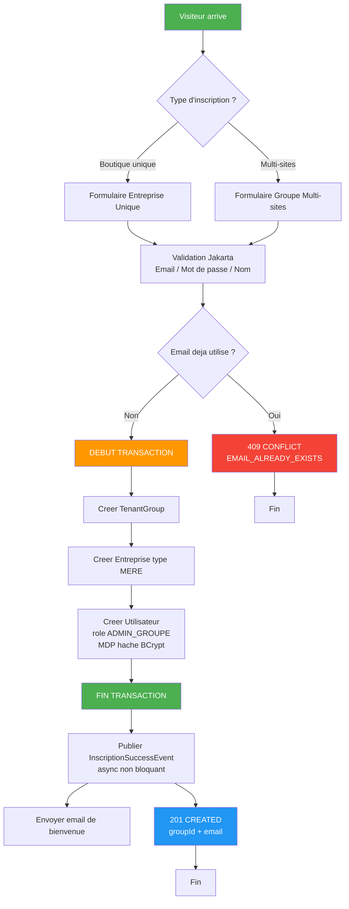
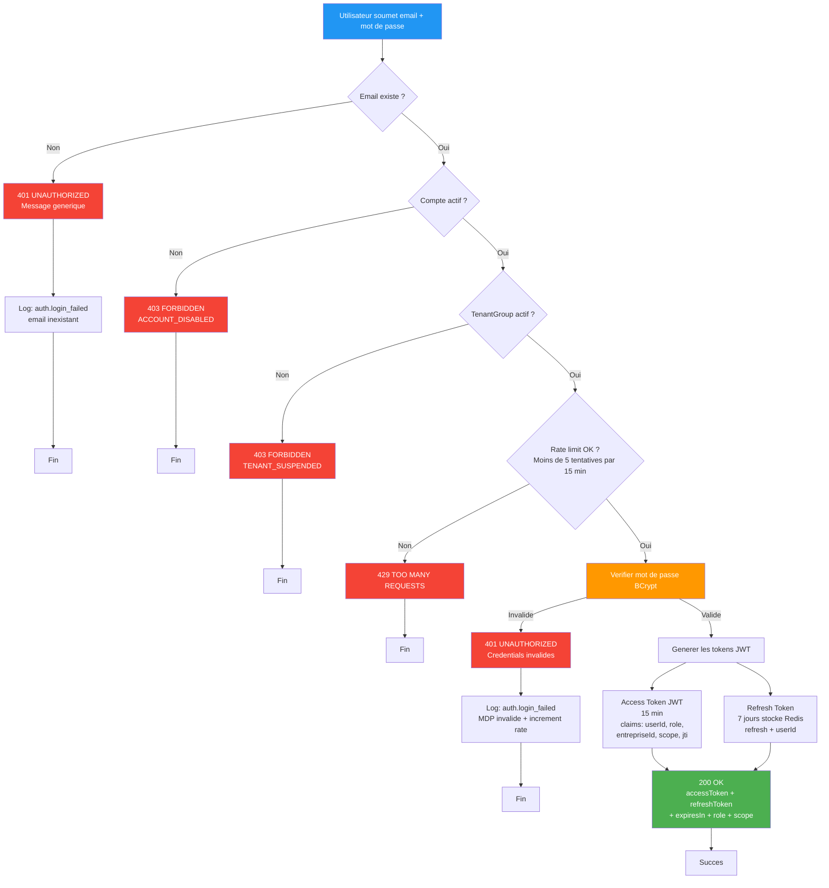
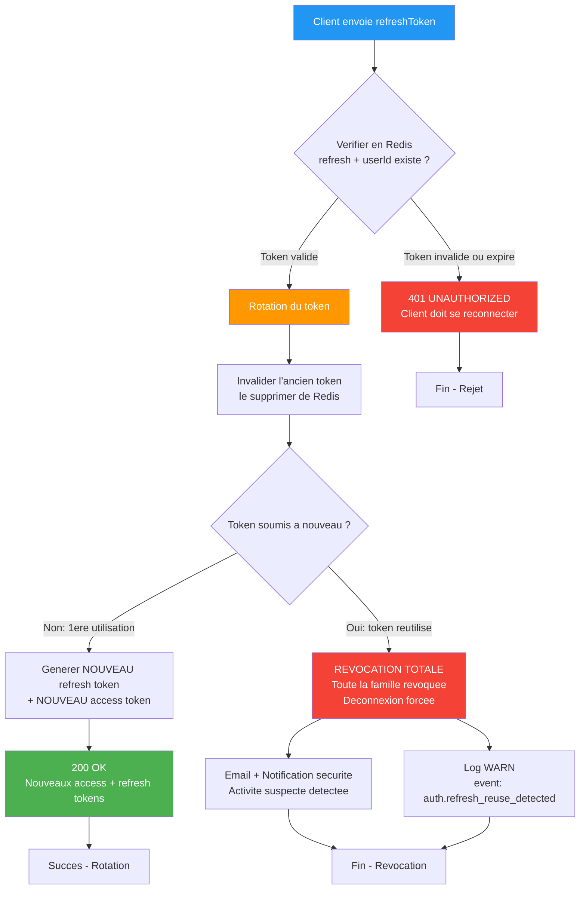
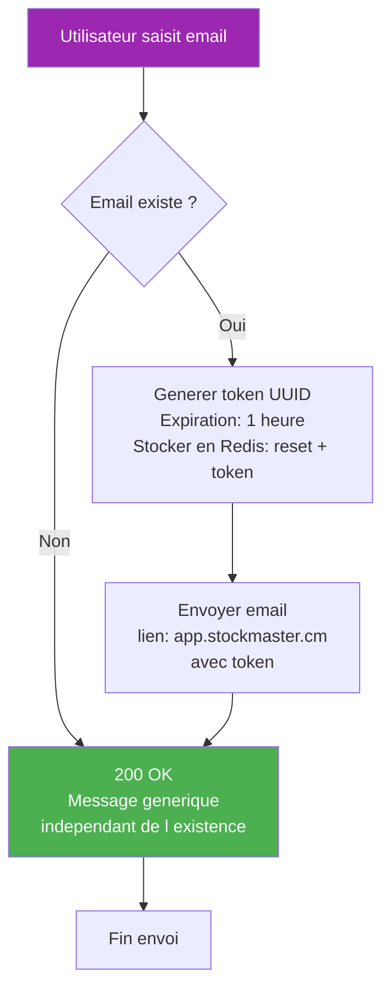
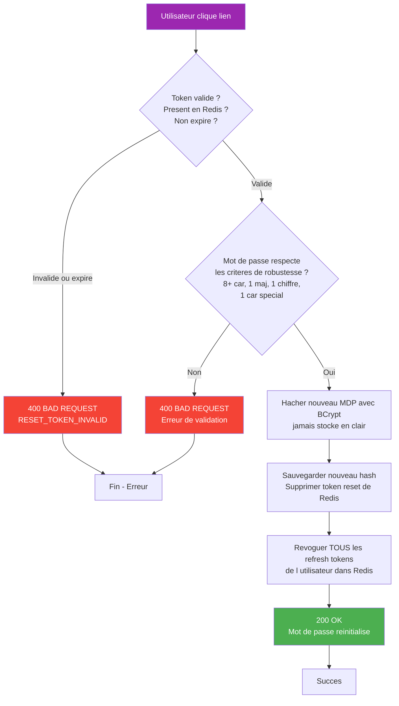

# 02 — Authentification & Acces (EPIC 2)

## Flux d'Inscription

## Flux de Connexion

## Flux Refresh Token avec Rotation (US-014)

## Flux Mot de Passe Oublie

## Flux Reinitialisation du Mot de Passe

