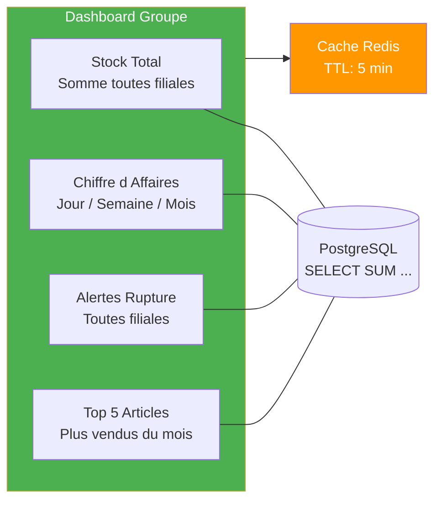

# 03 — Groupe & Filiales (EPIC 3)

## Structure Multi-Tenant

```mermaid
graph TB
    subgraph TenantGroup["TenantGroup"]
        TG[Groupe: Distribo Sarl<br/>Plan: PRO<br/>Limite: 15 filiales]
    end

    subgraph Holding["Maison Mere"]
        MM[Entreprise MERE<br/>Siege: Yaounde<br/>NIF: M123456789]
    end

    subgraph Filiales["Filiales"]
        F1[Filiale: Boutique Akwa<br/>Code: DLA01<br/>Ville: Douala]
        F2[Filiale: Entrepot Bassa<br/>Code: DLA02<br/>Ville: Douala]
        F3[Filiale: Magasin Centre<br/>Code: YDE01<br/>Ville: Yaounde]
    end

    subgraph Users["Utilisateurs"]
        AG[Admin Groupe<br/>Scope: GROUPE<br/>Voit TOUT]
        AF1[Admin Filiale Akwa<br/>Scope: FILIALE<br/>Voit Akwa seulement]
        AF2[Admin Filiale Bassa<br/>Scope: FILIALE<br/>Voit Bassa seulement]
        AF3[Admin Filiale Centre<br/>Scope: FILIALE<br/>Voit Centre seulement]
    end

    TenantGroup -->|possede| Holding
    TenantGroup -->|limite| Filiales
    Holding -->|parent de| F1
    Holding -->|parent de| F2
    Holding -->|parent de| F3
    Holding -->|emploie| AG
    F1 -->|emploie| AF1
    F2 -->|emploie| AF2
    F3 -->|emploie| AF3

    style Holding fill:#FF9800,color:white
    style TenantGroup fill:#9C27B0,color:white
    style AG fill:#2196F3,color:white
```



## Cycle de Vie d'une Filiale

```mermaid
graph TD
    Debut([Etat initial]) -->|Admin cree la filiale| Creation[Creee par Admin Groupe]
    Creation -->|Validation OK| Active([Active])

    Active -->|PATCH actif=false| Suspendue([Suspendue])
    Suspendue -->|PATCH actif=true| Active

    Active -->|Suppression| Fin1([Supprimee])
    Suspendue -->|Suppression| Fin1

    note right of Creation
        Verifications:
        - Limite plan pas depassee
        - Code filiale unique
        - Appartient au groupe
    end note

    style Active fill:#4CAF50,color:white
    style Suspendue fill:#FF9800,color:white
    style Debut fill:#9C27B0,color:white
```

## Dashboard Consolide Groupe


