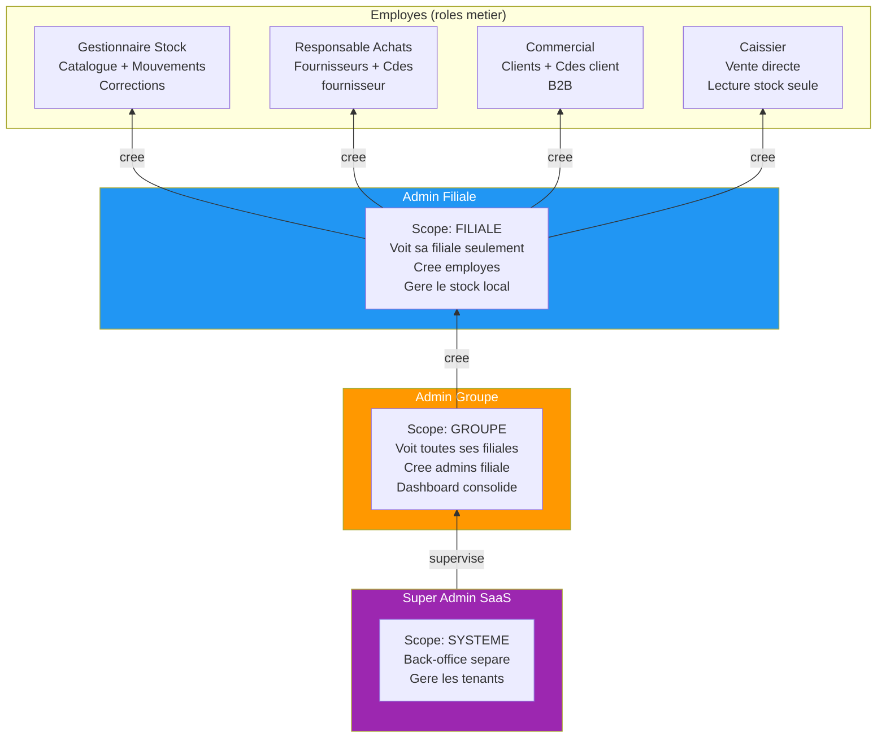
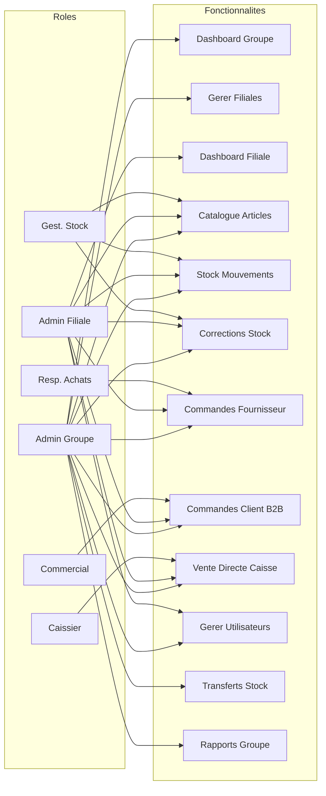

# 04 — Gestion des Utilisateurs (EPIC 4)

## Hierarchie des Roles (RBAC)

```mermaid
graph BT
    subgraph SuperAdmin["Super Admin SaaS"]
        SA[Scope: SYSTEME<br/>Back-office separe<br/>Gere les tenants]
    end

    subgraph AdminGroupe["Admin Groupe"]
        AG[Scope: GROUPE<br/>Voit toutes ses filiales<br/>Cree admins filiale<br/>Dashboard consolide]
    end

    subgraph AdminFiliale["Admin Filiale"]
        AF[Scope: FILIALE<br/>Voit sa filiale seulement<br/>Cree employes<br/>Gere le stock local]
    end

    subgraph Employes["Employes (roles metier)"]
        GS[Gestionnaire Stock<br/>Catalogue + Mouvements<br/>Corrections]
        RA[Responsable Achats<br/>Fournisseurs + Cdes<br/>fournisseur]
        CO[Commercial<br/>Clients + Cdes client<br/>B2B]
        CA[Caissier<br/>Vente directe<br/>Lecture stock seule]
    end

    SuperAdmin -->|supervise| AG
    AG -->|cree| AF
    AF -->|cree| GS
    AF -->|cree| RA
    AF -->|cree| CO
    AF -->|cree| CA

    style SuperAdmin fill:#9C27B0,color:white
    style AdminGroupe fill:#FF9800,color:white
    style AdminFiliale fill:#2196F3,color:white
```

## Matrice des Permissions

```mermaid
graph LR
    subgraph Features["Fonctionnalites"]
        F1[Dashboard Groupe]
        F2[Gerer Filiales]
        F3[Dashboard Filiale]
        F4[Catalogue Articles]
        F5[Stock Mouvements]
        F6[Corrections Stock]
        F7[Commandes Fournisseur]
        F8[Commandes Client B2B]
        F9[Vente Directe Caisse]
        F10[Gerer Utilisateurs]
        F11[Transferts Stock]
        F12[Rapports Groupe]
    end

    subgraph Roles["Roles"]
        R1[Admin Groupe]
        R2[Admin Filiale]
        R3[Gest. Stock]
        R4[Resp. Achats]
        R5[Commercial]
        R6[Caissier]
    end

    R1 --> F1
    R1 --> F2
    R1 --> F4
    R1 --> F5
    R1 --> F6
    R1 --> F7
    R1 --> F8
    R1 --> F9
    R1 --> F10
    R1 --> F11
    R1 --> F12

    R2 --> F3
    R2 --> F4
    R2 --> F5
    R2 --> F6
    R2 --> F7
    R2 --> F8
    R2 --> F9
    R2 --> F10

    R3 --> F4
    R3 --> F5
    R3 --> F6

    R4 --> F7
    R5 --> F8
    R6 --> F9
```
