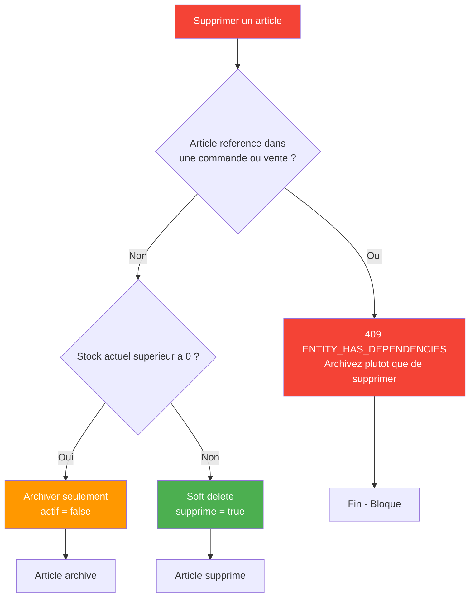

# 05 — Catalogue (EPIC 5)

## Structure Categories et Articles

```mermaid
graph LR
    subgraph Entreprise["Entreprise"]
        E[ID: 1<br/>Nom: Boutique Akwa]
    end

    subgraph Categories["Categories"]
        C1[ALIM - Alimentation<br/>TVA: 19.25%]
        C2[BOIS - Boissons<br/>TVA: 19.25%]
        C3[MEDA - Medicaments<br/>TVA: 0%]
    end

    subgraph Articles["Articles"]
        A1[RIZ50KG - Riz 50kg<br/>PA: 15000 | PV: 18500<br/>Seuil: 10]
        A2[HUILE5L - Huile 5L<br/>PA: 3500 | PV: 4800<br/>Seuil: 20]
        A3[SUCRE25 - Sucre 25kg<br/>PA: 12000 | PV: 15000<br/>Seuil: 5]
        A4[COCA24 - Coca 24x33cl<br/>PA: 5000 | PV: 6500<br/>Seuil: 15]
    end

    Entreprise -->|isole| Categories
    Entreprise -->|isole| Articles
    C1 -->|classe| A1
    C1 -->|classe| A2
    C1 -->|classe| A3
    C2 -->|classe| A4

    style Entreprise fill:#2196F3,color:white
    style Categories fill:#FF9800,color:white
```

## Cycle de Vie d'un Article

```mermaid
graph LR
    Debut([Etat initial]) --> Brouillon[Cree par Gestionnaire Stock]
    Brouillon --> Actif[Publie]
    Actif --> Archive[Plus commercialise<br/>soft delete preserve]
    Actif --> EnRupture[Stock = 0<br/>automatique]
    EnRupture --> Actif[Reapprovisionnement]

    note right of Actif
        Prix Vente TTC = PV HT x (1 + TVA/100)
        Calcule automatiquement
    end note
```

## Regles de Gestion - Creation d'article

```mermaid
graph TD
    Creation[Creer un article] --> Checks{Verifications obligatoires}

    Checks --> CodeUnique[Code article unique par entreprise ?]
    Checks --> CategorieExists[Categorie associee existe ?]
    Checks --> PrixValid[Prix achat HT inferieur au Prix vente HT ?]

    CodeUnique -->|Non| Error409[409 DUPLICATE_CODE]
    CategorieExists -->|Non| Error404[404 Categorie introuvable]
    PrixValid -->|Non| Error400[400 Prix incoherents]

    CodeUnique -->|Oui| OK1[OK]
    CategorieExists -->|Oui| OK2[OK]
    PrixValid -->|Oui| OK3[OK]

    OK1 --> Calc
    OK2 --> Calc
    OK3 --> Calc

    Calc[Calculer PV TTC<br/>= PV HT x (1 + TVA / 100)] --> Persist[Sauvegarder article en base]
    Persist --> EvictCache[Vider cache Redis @CacheEvict]
    EvictCache --> Success[Article cree avec succes]

    Error409 --> FinError1[Fin - Erreur]
    Error404 --> FinError2[Fin - Erreur]
    Error400 --> FinError3[Fin - Erreur]

    style Creation fill:#2196F3,color:white
    style Error409 fill:#f44336,color:white
    style Error404 fill:#f44336,color:white
    style Error400 fill:#f44336,color:white
    style Success fill:#4CAF50,color:white
    style Calc fill:#FF9800,color:white
```

## Regles de Gestion - Suppression d'article


