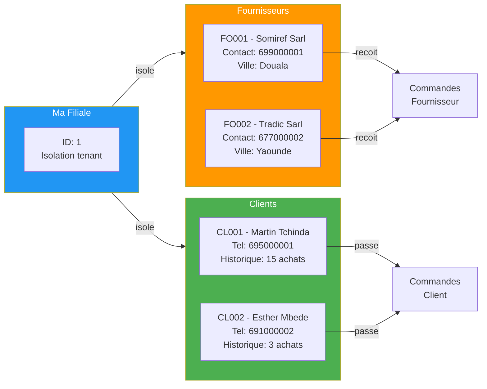
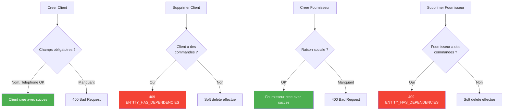

# 06 — Tiers (EPIC 6)

## Clients et Fournisseurs

```mermaid
graph LR
    subgraph Entreprise["Ma Filiale"]
        E[ID: 1<br/>Isolation tenant]
    end

    subgraph Fournisseurs["Fournisseurs"]
        F1[FO001 - Somiref Sarl<br/>Contact: 699000001<br/>Ville: Douala]
        F2[FO002 - Tradic Sarl<br/>Contact: 677000002<br/>Ville: Yaounde]
    end

    subgraph Clients["Clients"]
        C1[CL001 - Martin Tchinda<br/>Tel: 695000001<br/>Historique: 15 achats]
        C2[CL002 - Esther Mbede<br/>Tel: 691000002<br/>Historique: 3 achats]
    end

    Entreprise -->|isole| Fournisseurs
    Entreprise -->|isole| Clients

    F1 -->|recoit| Achats[Commandes<br/>Fournisseur]
    F2 -->|recoit| Achats
    C1 -->|passe| Ventes[Commandes<br/>Client]
    C2 -->|passe| Ventes

    style Entreprise fill:#2196F3,color:white
    style Fournisseurs fill:#FF9800,color:white
    style Clients fill:#4CAF50,color:white
```

## Regles de Gestion des Tiers

```mermaid
graph TD
    CreateClient[Creer Client] --> Validate{Champs obligatoires ?}
    Validate -->|Nom, Telephone OK| SaveClient[Client cree avec succes]
    Validate -->|Manquant| Error400[400 Bad Request]

    DeleteClient[Supprimer Client] --> HasOrders{Client a des<br/>commandes ?}
    HasOrders -->|Oui| Blocked[409 ENTITY_HAS_DEPENDENCIES]
    HasOrders -->|Non| SoftDeleteClient[Soft delete effectue]

    CreateFournisseur[Creer Fournisseur] --> ValidateF{Raison sociale ?}
    ValidateF -->|OK| SaveFournisseur[Fournisseur cree avec succes]
    ValidateF -->|Manquant| Error400F[400 Bad Request]

    DeleteFournisseur[Supprimer Fournisseur] --> HasOrdersF{Fournisseur a des<br/>commandes ?}
    HasOrdersF -->|Oui| BlockedF[409 ENTITY_HAS_DEPENDENCIES]
    HasOrdersF -->|Non| SoftDeleteF[Soft delete effectue]

    style Blocked fill:#f44336,color:white
    style BlockedF fill:#f44336,color:white
    style SaveClient fill:#4CAF50,color:white
    style SaveFournisseur fill:#4CAF50,color:white
```
