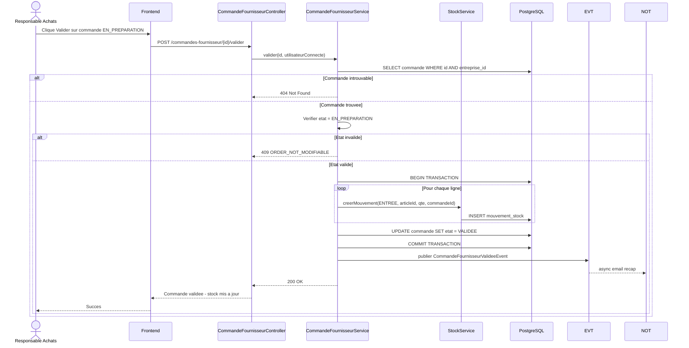

# 07 — Commandes Fournisseur / Achats (EPIC 7)

## Cycle de Vie d'une Commande Fournisseur

```mermaid
graph LR
    Debut([Etat initial]) --> EnPreparation[EN_PREPARATION<br/>Cree par Resp. Achats]

    EnPreparation --> EnPreparation2[Modification<br/>PUT /commandes-fournisseur/{id}]

    EnPreparation --> Validee[VALIDEE<br/>Validation<br/>POST /commandes-fournisseur/{id}/valider<br/>Etape critique]

    Validee --> Livree[LIVREE<br/>Reception physique<br/>POST /commandes-fournisseur/{id}/livrer]

    EnPreparation --> Supprimee[Suppression<br/>soft delete]

    Validee --> Termine1[Terminal: Immutable]
    Livree --> Termine2[Terminal: Immutable]

    note right of EnPreparation
        Code: CF-2026-0001
        Au moins 1 ligne requise
        Prix snapshot fige
    end note

    note right of Validee
        Operation ATOMIQUE:
        - Cree mouvement ENTREE pour chaque ligne
        - Met a jour le stock
        - Publie StockUpdatedEvent
        - Rollback si un mouvement echoue
    end note
```

## Flux de Validation d'une Commande Fournisseur



## Structure d'une Commande Fournisseur

```mermaid
graph TD
    subgraph Entete["En-tete"]
        Code[Code: CF-2026-0001]
        Fournisseur[Fournisseur: Somiref Sarl]
        Date[Date: 15/07/2026]
        Etat[Etat: EN_PREPARATION]
        Commentaire[Commentaire: Commande mensuelle]
    end

    subgraph Lignes["Lignes (2)"]
        L1[Article: RIZ50KG<br/>Qte: 50 | PU: 15000<br/>Total HT: 750000]
        L2[Article: HUILE5L<br/>Qte: 20 | PU: 3500<br/>Total HT: 70000]
    end

    subgraph Totals["Totaux"]
        TotalHT[Total HT: 820000]
        TVA[TVA 19.25%: 157850]
        TotalTTC[Total TTC: 977850]
    end

    Entete --> Lignes
    Lignes --> Totals

    style Entete fill:#2196F3,color:white
    style Lignes fill:#FF9800,color:white
    style Totals fill:#4CAF50,color:white
```
