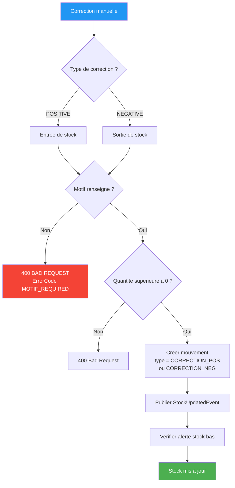
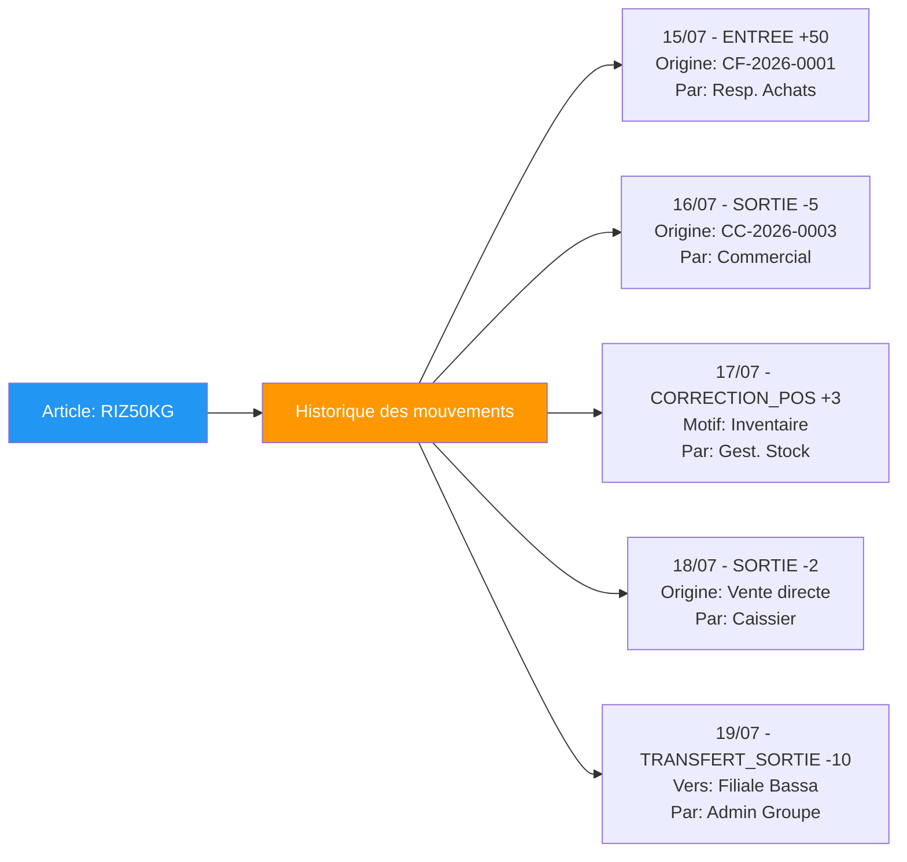

# 08 — Gestion du Stock (EPIC 8)

## Calcul du Stock en Temps Reel

```mermaid
graph TD
    StockReel[Stock Reel] --> Calcul[= SOMME des mouvements]

    Calcul --> Entrees[+ ENTREE<br/>Commandes fournisseur validees]
    Calcul --> CorrectionsPos[+ CORRECTION_POS<br/>Inventaire surplus]
    Calcul --> TransfertsIn[+ TRANSFERT_ENTREE<br/>Recu d une autre filiale]
    Calcul --> Sorties[- SORTIE<br/>Commandes client validees]
    Calcul --> CorrectionsNeg[- CORRECTION_NEG<br/>Casse / Perte / Vol]
    Calcul --> TransfertsOut[- TRANSFERT_SORTIE<br/>Envoye a une autre filiale]
    Calcul --> Annulations[+ ANNULATION_VENTE<br/>Vente annulee (compensatoire)]
    Calcul --> Remboursements[+ REMBOURSEMENT<br/>Retour en caisse (compensatoire)]

    StockReel --> Alerte{Comparer avec<br/>seuil_alerte}
    Alerte -->|Stock strictement negatif| Anomalie[ANOMALIE<br/>erreur de donnee]
    Alerte -->|Stock egal a 0| Rupture[RUPTURE]
    Alerte -->|Stock inferieur ou egal au seuil| Bas[BAS]
    Alerte -->|Stock superieur au seuil| Normal[NORMAL]

    style Anomalie fill:#7b1fa2,color:white
    style Rupture fill:#f44336,color:white
    style Bas fill:#FF9800,color:white
    style Normal fill:#4CAF50,color:white
    style StockReel fill:#2196F3,color:white
```

## Flux de Correction de Stock



## Historique des Mouvements


