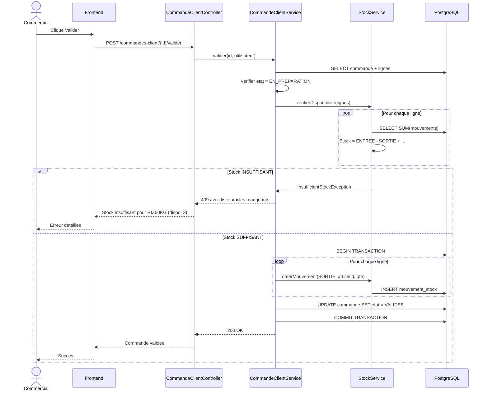

# 09 — Commandes Client / Ventes B2B (EPIC 9)

## Cycle de Vie d'une Commande Client

```mermaid
graph LR
    Debut([Etat initial]) --> EnPreparation[EN_PREPARATION<br/>Cree par Commercial]
    EnPreparation --> EnPreparation2[Modification<br/>PUT /commandes-client/{id}]
    EnPreparation --> Validee[VALIDEE<br/>Validation bloquante<br/>POST /commandes-client/{id}/valider]
    Validee --> Livree[LIVREE<br/>Livraison<br/>POST /commandes-client/{id}/livrer]
    EnPreparation --> Supprimee[Supprimee<br/>soft delete]
    Validee --> Termine1[Terminal: Immutable]
    Livree --> Termine2[Terminal: Immutable]

    note right of EnPreparation
        Code: CC-2026-0001
        Prix snapshot fige
        TVA snapshot fige
    end note

    note right of Validee
        Verification STOCK bloquante:
        1. Verifier stock pour CHAQUE ligne
        2. Si un article manque -> 409 InsufficientStock
        3. Si OK -> creer SORTIE + valider (atomique)
    end note
```

## Flux de Validation avec Verification de Stock


