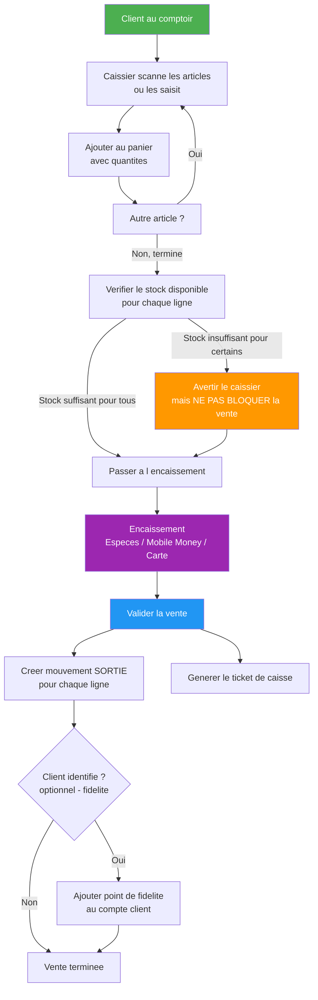

# 10 — Vente Directe / Caisse (EPIC 10)

## Flux de Vente Directe



## Annulation d'une Vente

```mermaid
graph TD
    Annulation[Annuler une vente] --> CheckStatut{Statut actuel de la vente ?}

    CheckStatut -->|ANNULEE| Error[400 BAD REQUEST<br/>Vente deja annulee]
    CheckStatut -->|VALIDEE| Proceed[Proceder a l annulation]

    Proceed --> Compensate[Creer mouvement ANNULATION_VENTE<br/>Quantite compensatoire positive<br/>pour remettre le stock a niveau]

    Compensate --> UpdateStatut[Passer le statut vente a ANNULEE]
    UpdateStatut --> Log[Logger evenement d annulation]
    Log --> Success[Vente annulee avec succes]

    Error --> FinError[Fin - Erreur]

    note right of Compensate
        Principe d audit:
        Le mouvement SORTIE original
        n est JAMAIS supprime.
        Un mouvement inverse
        ANNULATION_VENTE est cree
        pour preserver la tracabilite.
    end note

    style Annulation fill:#f44336,color:white
    style Compensate fill:#FF9800,color:white
    style Success fill:#4CAF50,color:white
    style Error fill:#f44336,color:white
```

## Structure d'une Vente

```mermaid
graph LR
    subgraph Vente["Vente Directe"]
        V[ID: 1<br/>Date: 15/07/2026 14:30<br/>Caissier: Paul Biya<br/>Statut: VALIDEE]
    end

    subgraph ClientInfo["Client"]
        C[Non identifie<br/>vente directe sans client]
    end

    subgraph Lignes["Lignes (3)"]
        L1[Riz 50kg x 2<br/>PU: 18500 | Total: 37000]
        L2[Huile 5L x 1<br/>PU: 4800 | Total: 4800]
        L3[Sucre 25kg x 1<br/>PU: 15000 | Total: 15000]
    end

    subgraph Total["Total"]
        T[Total TTC: 56800<br/>Paye: 60000<br/>Monnaie: 3200]
    end

    Vente --> ClientInfo
    Vente --> Lignes
    Lignes --> Total

    style Vente fill:#2196F3,color:white
    style ClientInfo fill:#9C27B0,color:white
    style Lignes fill:#FF9800,color:white
    style Total fill:#4CAF50,color:white
```
