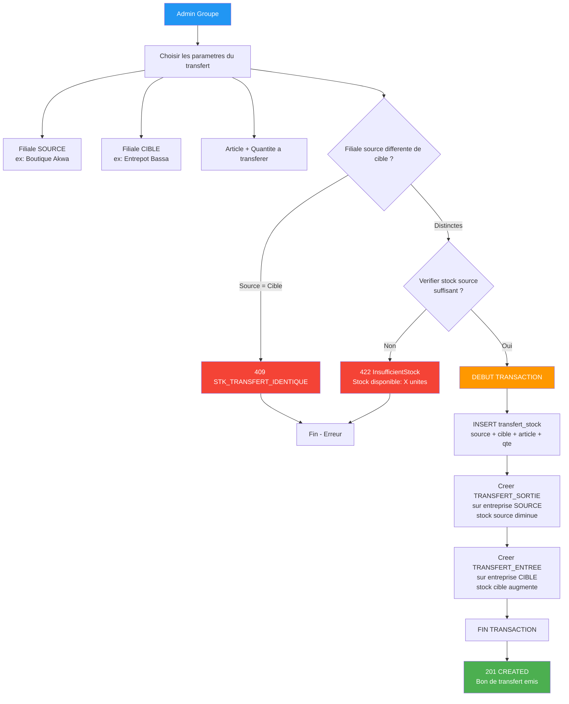
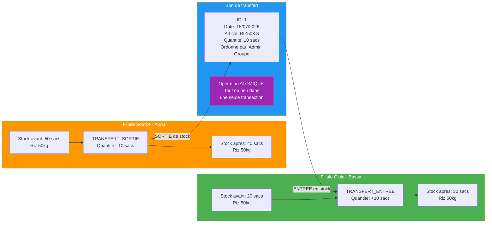

# 11 — Transferts Inter-Filiales (EPIC 11)

## Flux de Transfert de Stock

```mermaid
graph TD
    Start[Admin Groupe] --> Select[Choisir les parametres du transfert]
    Select --> Source[Filiale SOURCE<br/>ex: Boutique Akwa]
    Select --> Target[Filiale CIBLE<br/>ex: Entrepot Bassa]
    Select --> Article[Article + Quantite a transferer]

    Select --> Validate{Filiale source differente de cible ?}

    Validate -->|Source = Cible| Error[409 STK_TRANSFERT_IDENTIQUE]
    Validate -->|Distinctes| CheckStock{Verifier stock source<br/>suffisant ?}

    CheckStock -->|Non| ErrorStock[422 InsufficientStock<br/>Stock disponible: X unites]
    CheckStock -->|Oui| Transaction[DEBUT TRANSACTION]

    Transaction --> Insert[INSERT transfert_stock<br/>source + cible + article + qte]

    Insert --> MvtSource[Creer TRANSFERT_SORTIE<br/>sur entreprise SOURCE<br/>stock source diminue]
    MvtSource --> MvtTarget[Creer TRANSFERT_ENTREE<br/>sur entreprise CIBLE<br/>stock cible augmente]

    MvtTarget --> Commit[FIN TRANSACTION]
    Commit --> Success[201 CREATED<br/>Bon de transfert emis]

    Error --> FinError[Fin - Erreur]
    ErrorStock --> FinError

    style Start fill:#2196F3,color:white
    style Error fill:#f44336,color:white
    style ErrorStock fill:#f44336,color:white
    style Success fill:#4CAF50,color:white
    style Transaction fill:#FF9800,color:white
```

## Double Mouvement Atomique

```mermaid
graph LR
    subgraph Source["Filiale Source - Akwa"]
        StockAvantSource[Stock avant: 50 sacs<br/>Riz 50kg]
        MouvementSortie[TRANSFERT_SORTIE<br/>Quantite: -10 sacs]
        StockApresSource[Stock apres: 40 sacs<br/>Riz 50kg]
    end

    subgraph Transfert["Bon de transfert"]
        Bon[ID: 1<br/>Date: 15/07/2026<br/>Article: RIZ50KG<br/>Quantite: 10 sacs<br/>Ordonne par: Admin Groupe]
        Note[Operation ATOMIQUE:<br/>Tout ou rien dans<br/>une seule transaction]
    end

    subgraph Cible["Filiale Cible - Bassa"]
        StockAvantCible[Stock avant: 20 sacs<br/>Riz 50kg]
        MouvementEntree[TRANSFERT_ENTREE<br/>Quantite: +10 sacs]
        StockApresCible[Stock apres: 30 sacs<br/>Riz 50kg]
    end

    MouvementSortie -->|SORTIE de stock| Bon
    Bon -->|ENTREE en stock| MouvementEntree

    StockAvantSource --> MouvementSortie
    MouvementSortie --> StockApresSource

    StockAvantCible --> MouvementEntree
    MouvementEntree --> StockApresCible

    style Source fill:#FF9800,color:white
    style Cible fill:#4CAF50,color:white
    style Transfert fill:#2196F3,color:white
    style Note fill:#9C27B0,color:white
```
