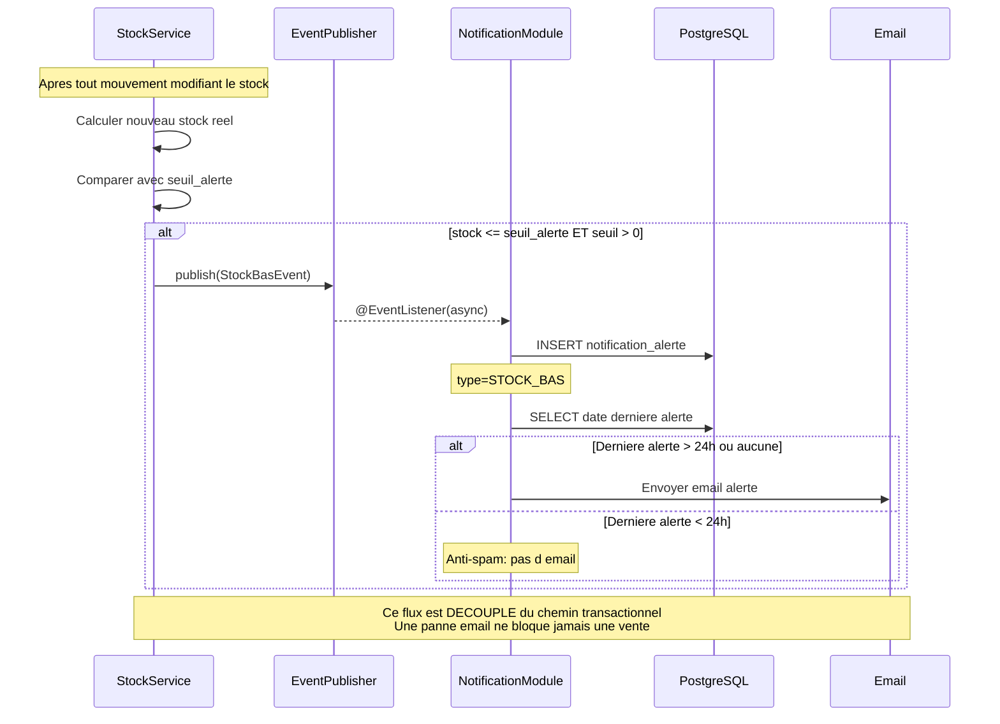
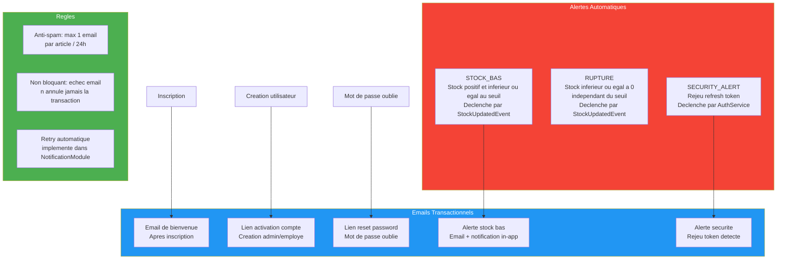

# 12 — Notifications & Alertes (EPIC 12)

## Flux d'Alerte de Stock Bas

```mermaid
sequenceDiagram
    participant STK as StockService
    participant EVT as EventPublisher
    participant NOT as NotificationModule
    participant DB as PostgreSQL
    participant MAIL as Email

    Note over STK: Apres tout mouvement modifiant le stock

    STK->>STK: Calculer nouveau stock reel
    STK->>STK: Comparer avec seuil_alerte

    alt stock <= seuil_alerte ET seuil > 0
        STK->>EVT: publish(StockBasEvent)

        EVT-->>NOT: @EventListener(async)

        NOT->>DB: INSERT notification_alerte
        Note over NOT: type=STOCK_BAS

        NOT->>DB: SELECT date derniere alerte

        alt Derniere alerte > 24h ou aucune
            NOT->>MAIL: Envoyer email alerte
        else Derniere alerte < 24h
            Note over NOT: Anti-spam: pas d email
        end
    end

    Note over STK,MAIL: Ce flux est DECOUPLE du chemin transactionnel<br/>Une panne email ne bloque jamais une vente
```

## Types de Notifications

```mermaid
graph TD
    subgraph Alertes["Alertes Automatiques"]
        A1[STOCK_BAS<br/>Stock positif et inferieur ou egal au seuil<br/>Declenche par StockUpdatedEvent]
        A3[RUPTURE<br/>Stock inferieur ou egal a 0<br/>independant du seuil<br/>Declenche par StockUpdatedEvent]
        A2[SECURITY_ALERT<br/>Rejeu refresh token<br/>Declenche par AuthService]
    end

    subgraph Emails["Emails Transactionnels"]
        E1[Email de bienvenue<br/>Apres inscription]
        E2[Lien activation compte<br/>Creation admin/employe]
        E3[Lien reset password<br/>Mot de passe oublie]
        E4[Alerte stock bas<br/>Email + notification in-app]
        E5[Alerte securite<br/>Rejeu token detecte]
    end

    subgraph Regles["Regles"]
        R1[Anti-spam: max 1 email<br/>par article / 24h]
        R2[Non bloquant: echec email<br/>n annule jamais la transaction]
        R3[Retry automatique<br/>implemente dans NotificationModule]
    end

    A1 --> E4
    A2 --> E5
    Inscription[Inscription] --> E1
    CreationUser[Creation utilisateur] --> E2
    ForgotPwd[Mot de passe oublie] --> E3

    style Alertes fill:#f44336,color:white
    style Emails fill:#2196F3,color:white
    style Regles fill:#4CAF50,color:white
```
