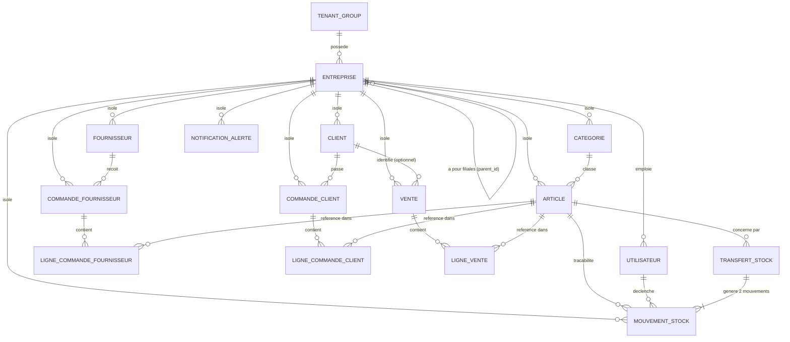
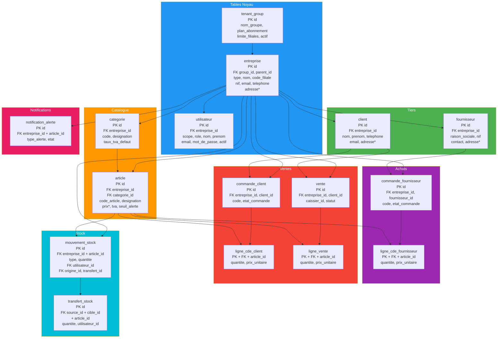

# 13 — Modele de Donnees (ERD)

## Diagramme Entite-Relation

```mermaid
erDiagram
    TENANT_GROUP ||--o{ ENTREPRISE : "possede"
    ENTREPRISE ||--o{ ENTREPRISE : "a pour filiales (parent_id)"
    ENTREPRISE ||--o{ UTILISATEUR : "emploie"
    ENTREPRISE ||--o{ CATEGORIE : "isole"
    ENTREPRISE ||--o{ ARTICLE : "isole"
    ENTREPRISE ||--o{ CLIENT : "isole"
    ENTREPRISE ||--o{ FOURNISSEUR : "isole"
    ENTREPRISE ||--o{ MOUVEMENT_STOCK : "isole"
    ENTREPRISE ||--o{ COMMANDE_FOURNISSEUR : "isole"
    ENTREPRISE ||--o{ COMMANDE_CLIENT : "isole"
    ENTREPRISE ||--o{ VENTE : "isole"
    ENTREPRISE ||--o{ NOTIFICATION_ALERTE : "isole"

    CATEGORIE ||--o{ ARTICLE : "classe"
    FOURNISSEUR ||--o{ COMMANDE_FOURNISSEUR : "recoit"
    COMMANDE_FOURNISSEUR ||--o{ LIGNE_COMMANDE_FOURNISSEUR : "contient"
    ARTICLE ||--o{ LIGNE_COMMANDE_FOURNISSEUR : "reference dans"
    CLIENT ||--o{ COMMANDE_CLIENT : "passe"
    CLIENT ||--o{ VENTE : "identifie (optionnel)"
    COMMANDE_CLIENT ||--o{ LIGNE_COMMANDE_CLIENT : "contient"
    ARTICLE ||--o{ LIGNE_COMMANDE_CLIENT : "reference dans"
    VENTE ||--o{ LIGNE_VENTE : "contient"
    ARTICLE ||--o{ LIGNE_VENTE : "reference dans"
    ARTICLE ||--o{ MOUVEMENT_STOCK : "tracabilite"
    UTILISATEUR ||--o{ MOUVEMENT_STOCK : "declenche"
    TRANSFERT_STOCK ||--|{ MOUVEMENT_STOCK : "genere 2 mouvements"
    ARTICLE ||--o{ TRANSFERT_STOCK : "concerne par"
```

## Tables Principales

```mermaid
graph TD
    subgraph Core["Tables Noyau"]
        TG[tenant_group<br/>PK id<br/>nom_groupe, plan_abonnement<br/>limite_filiales, actif]
        E[entreprise<br/>PK id<br/>FK group_id, parent_id<br/>type, nom, code_filiale<br/>nif, email, telephone<br/>adresse*]
        U[utilisateur<br/>PK id<br/>FK entreprise_id<br/>scope, role, nom, prenom<br/>email, mot_de_passe, actif]
    end

    subgraph Catalog["Catalogue"]
        CAT[categorie<br/>PK id<br/>FK entreprise_id<br/>code, designation<br/>taux_tva_defaut]
        ART[article<br/>PK id<br/>FK entreprise_id<br/>FK categorie_id<br/>code_article, designation<br/>prix*, tva, seuil_alerte]
    end

    subgraph Tiers["Tiers"]
        CL[client<br/>PK id<br/>FK entreprise_id<br/>nom, prenom, telephone<br/>email, adresse*]
        FR[fournisseur<br/>PK id<br/>FK entreprise_id<br/>raison_sociale, nif<br/>contact, adresse*]
    end

    subgraph Achats["Achats"]
        CF[commande_fournisseur<br/>PK id<br/>FK entreprise_id, fournisseur_id<br/>code, etat_commande]
        LCF[ligne_cde_fournisseur<br/>PK + FK + article_id<br/>quantite, prix_unitaire]
    end

    subgraph Ventes["Ventes"]
        CC[commande_client<br/>PK id<br/>FK entreprise_id, client_id<br/>code, etat_commande]
        LCC[ligne_cde_client<br/>PK + FK + article_id<br/>quantite, prix_unitaire]
        V[vente<br/>PK id<br/>FK entreprise_id, client_id<br/>caissier_id, statut]
        LV[ligne_vente<br/>PK + FK + article_id<br/>quantite, prix_unitaire]
    end

    subgraph Stock["Stock"]
        MS[mouvement_stock<br/>PK id<br/>FK entreprise_id + article_id<br/>type, quantite<br/>FK utilisateur_id<br/>FK origine_id, transfert_id]
        TS[transfert_stock<br/>PK id<br/>FK source_id + cible_id<br/>+ article_id<br/>quantite, utilisateur_id]
    end

    subgraph Notif["Notifications"]
        NA[notification_alerte<br/>PK id<br/>FK entreprise_id + article_id<br/>type_alerte, etat]
    end

    TG --> E
    E --> U
    E --> CAT
    E --> ART
    E --> CL
    E --> FR
    E --> CF
    E --> CC
    E --> V
    E --> MS
    E --> NA
    CAT --> ART
    CL --> CC
    CL --> V
    FR --> CF
    CF --> LCF
    CC --> LCC
    V --> LV
    ART --> LCF
    ART --> LCC
    ART --> LV
    ART --> MS
    MS --> TS

    style Core fill:#2196F3,color:white
    style Catalog fill:#FF9800,color:white
    style Tiers fill:#4CAF50,color:white
    style Achats fill:#9C27B0,color:white
    style Ventes fill:#f44336,color:white
    style Stock fill:#00BCD4,color:white
    style Notif fill:#E91E63,color:white
```
