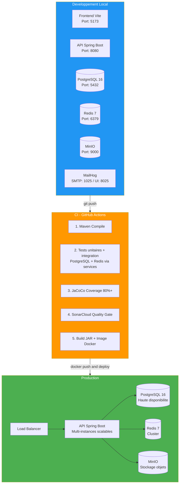
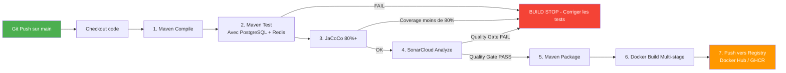

# 14 — Architecture Deploiement & Securite

## Architecture de Deploiement



## Architecture de Securite

```mermaid
graph TD
    subgraph AuthFlow["1. Flux d authentification"]
        User[Utilisateur] -->|Credentials| Login[POST /auth/login]
        Login --> RateLimit{Rate Limiting Redis}
        RateLimit -->|<= 5 tentatives| VerifyAuth[Verifier credentials]
        VerifyAuth -->|Succes| JWT[Generer JWT - jjwt 0.12.6 HS256]
        JWT --> AccessToken[Access Token<br/>15 min<br/>claims: userId, role,<br/>entrepriseId, scope, jti]
        JWT --> RefreshToken[Refresh Token<br/>7 jours<br/>stocke Redis<br/>refresh + userId]
    end

    subgraph Protection["2. Protection des requetes"]
        Req[Requete entrante] --> JwtFilter[JwtAuthenticationFilter]
        JwtFilter --> Extract[Extraire Bearer token]
        Extract --> ValidateJWT{Verifier signature<br/>+ expiration JWT}
        ValidateJWT -->|Invalide| Reject[401 Unauthorized]
        ValidateJWT -->|Valide| CheckBlacklist{Token blackliste ?<br/>blacklist + jti + jti}
        CheckBlacklist -->|Oui| Reject
        CheckBlacklist -->|Non| SetContext[Set SecurityContext<br/>StockMasterPrincipal]
        SetContext --> Controller[Endpoint protege]
        Controller --> CheckAuth{@PreAuthorize OK ?}
        CheckAuth -->|Non| AccessDenied[403 Forbidden]
        CheckAuth -->|Oui| MultiTenant[Verifier isolation tenant<br/>entreprise_id du JWT]
    end

    subgraph Isolation["3. Isolation multi-tenant"]
        Rule[Regle ABSOLUE:<br/>entreprise_id vient TOUJOURS du JWT<br/>JAMAIS du body de la requete]
        Violation[Violation = 404 Not Found<br/>ne jamais reveler l existence]
    end

    subgraph FailClosed["4. Comportement fail-closed"]
        FC[Si Redis est DOWN:]
        FC1[Login -> 503 SERVICE_UNAVAILABLE]
        FC2[Refresh -> 503 SERVICE_UNAVAILABLE]
        FC3[Logout -> 503 SERVICE_UNAVAILABLE]
        Never[JAMAIS de fail-open<br/>sur les operations de securite]
    end

    style AuthFlow fill:#2196F3,color:white
    style Protection fill:#FF9800,color:white
    style Isolation fill:#f44336,color:white
    style FailClosed fill:#9C27B0,color:white
```

## Pipeline CI/CD


