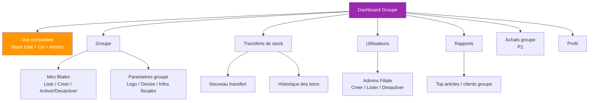
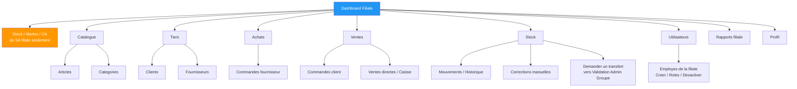
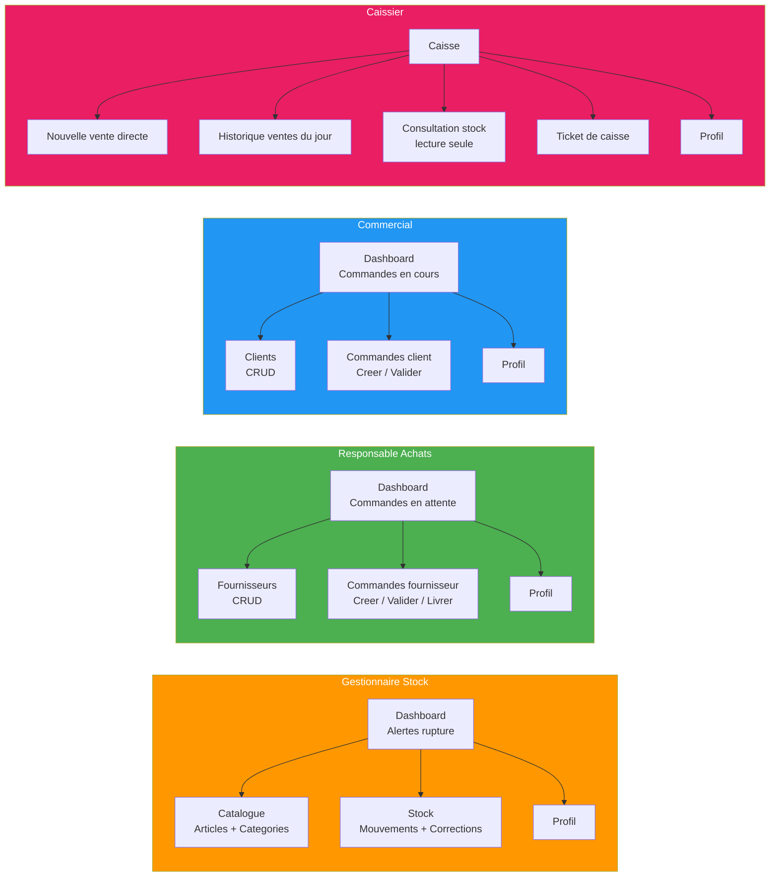
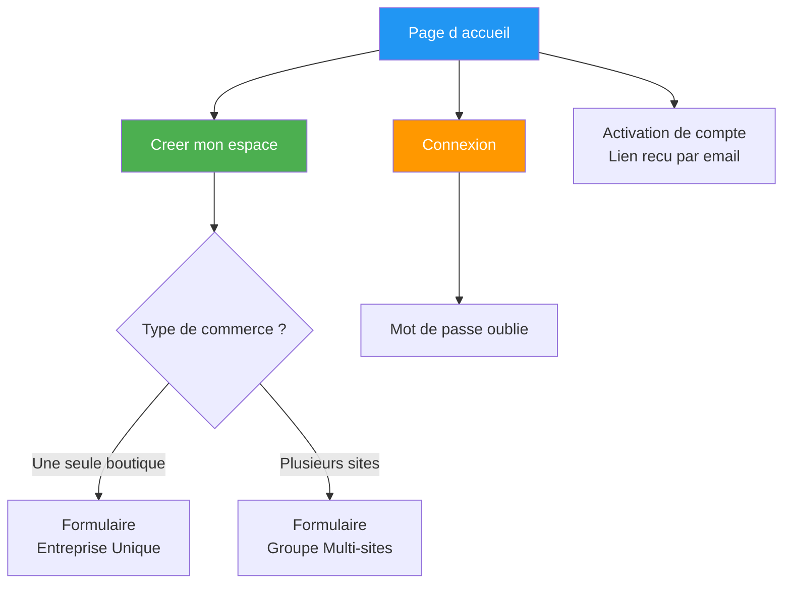

# 15 — Navigation Frontend par Role

## Arborescence - Admin Groupe

```mermaid
graph TD
    A[Dashboard Groupe] --> A1[Vue consolidee<br/>Stock total + CA + Alertes]

    A --> B[Groupe]
    B --> B1[Mes filiales<br/>Liste / Creer / Activer/Desactiver]
    B --> B2[Parametres groupe<br/>Logo / Devise / Infos fiscales]

    A --> C[Transferts de stock]
    C --> C1[Nouveau transfert]
    C --> C2[Historique des bons]

    A --> D[Utilisateurs]
    D --> D1[Admins Filiale<br/>Creer / Lister / Desactiver]

    A --> E[Rapports]
    E --> E1[Top articles / clients groupe]

    A --> F[Achats groupe<br/>P2]
    A --> G[Profil]

    style A fill:#9C27B0,color:white
    style A1 fill:#FF9800,color:white
```

## Arborescence - Admin Filiale

```mermaid
graph TD
    A[Dashboard Filiale] --> A1[Stock / Alertes / CA<br/>de SA filiale seulement]

    A --> B[Catalogue]
    B --> B1[Articles]
    B --> B2[Categories]

    A --> C[Tiers]
    C --> C1[Clients]
    C --> C2[Fournisseurs]

    A --> D[Achats]
    D --> D1[Commandes fournisseur]

    A --> E[Ventes]
    E --> E1[Commandes client]
    E --> E2[Ventes directes / Caisse]

    A --> F[Stock]
    F --> F1[Mouvements / Historique]
    F --> F2[Corrections manuelles]
    F --> F3[Demander un transfert<br/>vers Validation Admin Groupe]

    A --> G[Utilisateurs]
    G --> G1[Employes de la filiale<br/>Creer / Roles / Desactiver]

    A --> H[Rapports filiale]
    A --> I[Profil]

    style A fill:#2196F3,color:white
    style A1 fill:#FF9800,color:white
```

## Arborescences - Employes

```mermaid
graph LR
    subgraph GestStock["Gestionnaire Stock"]
        GS[Dashboard<br/>Alertes rupture]
        GS --> GSC[Catalogue<br/>Articles + Categories]
        GS --> GSS[Stock<br/>Mouvements + Corrections]
        GS --> GSP[Profil]
    end

    subgraph RespAchats["Responsable Achats"]
        RA[Dashboard<br/>Commandes en attente]
        RA --> RAF[Fournisseurs<br/>CRUD]
        RA --> RAC[Commandes fournisseur<br/>Creer / Valider / Livrer]
        RA --> RAP[Profil]
    end

    subgraph Commercial["Commercial"]
        CO[Dashboard<br/>Commandes en cours]
        CO --> COC[Clients<br/>CRUD]
        CO --> COV[Commandes client<br/>Creer / Valider]
        CO --> COP[Profil]
    end

    subgraph Caissier["Caissier"]
        CA[Caisse]
        CA --> CAV[Nouvelle vente directe]
        CA --> CAH[Historique ventes du jour]
        CA --> CAL[Consultation stock<br/>lecture seule]
        CA --> CAT[Ticket de caisse]
        CA --> CAP[Profil]
    end

    style GestStock fill:#FF9800,color:white
    style RespAchats fill:#4CAF50,color:white
    style Commercial fill:#2196F3,color:white
    style Caissier fill:#E91E63,color:white
```

## Espace Public (Non Authentifie)

```mermaid
graph TD
    A[Page d accueil] --> B[Creer mon espace]

    B --> C{Type de commerce ?}
    C -->|Une seule boutique| D[Formulaire<br/>Entreprise Unique]
    C -->|Plusieurs sites| E[Formulaire<br/>Groupe Multi-sites]

    A --> F[Connexion]
    F --> G[Mot de passe oublie]

    A --> H[Activation de compte<br/>Lien recu par email]

    style A fill:#2196F3,color:white
    style B fill:#4CAF50,color:white
    style F fill:#FF9800,color:white
```
