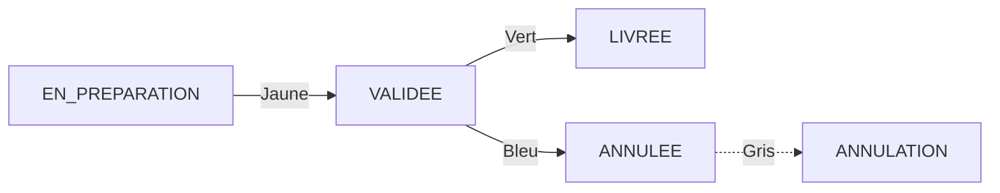

# 🎓 Formation Design UX/UI — StockMaster CM
> **Cours exhaustif** couvrant **US-D001 à US-D102** du backlog design.
> Garde ce fichier pendant ta formation, supprime-le quand tu maîtrises.
>
> **Public :** Siko — Designer UX/UI
> **Prérequis :** Notions de base en design d'interface
> **Concepts couverts :** 100+ concepts UX, UI, Design System, Figma, accessibilité, prototypage

---

## Table des matières

1. [UX vs UI — Les fondamentaux](#1-ux-vs-ui--les-fondamentaux)
2. [Design System — EPIC-D00 (US-D001 à D007)](#2-design-system--epic-d00-us-d001-à-d007)
3. [Espace Public & Onboarding — EPIC-D01 (US-D010 à D015)](#3-espace-public--onboarding-epic-d01-us-d010-à-d015)
4. [Dashboards — EPIC-D02 (US-D020 à D023)](#4-dashboards-epic-d02-us-d020-à-d023)
5. [Catalogue — EPIC-D03 (US-D030 à D034)](#5-catalogue-epic-d03-us-d030-à-d034)
6. [Tiers — EPIC-D04 (US-D040 à D042)](#6-tiers-epic-d04-us-d040-à-d042)
7. [Commandes Fournisseur — EPIC-D05 (US-D050 à D053)](#7-commandes-fournisseur-epic-d05-us-d050-à-d053)
8. [Commandes Client & Caisse — EPIC-D06 (US-D060 à D065)](#8-commandes-client--caisse-epic-d06-us-d060-à-d065)
9. [Stock — EPIC-D07 (US-D070 à D074)](#9-stock-epic-d07-us-d070-à-d074)
10. [Groupe/Filiales/Utilisateurs — EPIC-D08 (US-D080 à D083)](#10-groupefilialesutilisateurs-epic-d08-us-d080-à-d083)
11. [Reporting — EPIC-D09 (US-D090 à D093)](#11-reporting-epic-d09-us-d090-à-d093)
12. [Back-office Super Admin — EPIC-D10 (US-D100 à D102)](#12-back-office-super-admin-epic-d10-us-d100-à-d102)
13. [Glossaire & Concepts Clés](#13-glossaire--concepts-clés)

---

## 1. UX vs UI — Les fondamentaux

### 🧠 C'est quoi l'UX ?

**UX = User Experience** = l'expérience que vit l'utilisateur quand il utilise le produit.

L'UX répond à des questions comme :
- Est-ce que l'utilisateur trouve ce qu'il cherche en moins de 3 clics ?
- Est-ce que le parcours de caisse est fluide ou frustrant ?
- Est-ce que l'erreur "stock insuffisant" est compréhensible immédiatement ?

**Les 5 niveaux de l'UX (concept de Jesse James Garrett) :**

```
┌─────────────────────────────────┐
│  Surface : Design visuel final   │ ← Couleurs, icônes, typographie
├─────────────────────────────────┤
│  Squelette : Placement des élts  │ ← Où est le bouton "Valider" ?
├─────────────────────────────────┤
│  Structure : Navigation & flux   │ ← Comment on va de l'écran A à l'écran B ?
├─────────────────────────────────┤
│  Périmètre : Fonctionnalités     │ ← Quels boutons/écrans sont disponibles ?
├─────────────────────────────────┤
│  Stratégie : Objectifs métier    │ ← Pourquoi le caissier utilise-t-il cette app ?
└─────────────────────────────────┘
```

**Exemple concret StockMaster — Le parcours caisse (US-D063) :**

Au niveau **Stratégie** : Le caissier doit encaisser un client en moins de 30 secondes.
Au niveau **Périmètre** : Il a besoin de : recherche article → sélection quantité → total → paiement.
Au niveau **Structure** : La recherche d'article doit être le premier écran visible.
Au niveau **Squelette** : La barre de recherche est en haut. Les articles récents sont visibles.
Au niveau **Surface** : Grands boutons tactiles (écran souvent sale en point de vente).

### 🎨 C'est quoi l'UI ?

**UI = User Interface** = l'aspect **visuel** du produit.

L'UI répond à des questions comme :
- Est-ce que le bleu du bouton "Valider" est cohérent sur tous les écrans ?
- Est-ce que la police est lisible sur un écran de téléphone à 360px ?
- Est-ce que l'espacement entre les lignes du tableau est confortable ?

### La différence en une phrase :

> **L'UX, c'est que le frigo s'ouvre quand tu tires sur la poignée.**
> **L'UI, c'est que la poignée est belle et agréable à toucher.**

---

### 🎯 Les cibles utilisateurs de StockMaster CM

Le design doit être adapté à **5 profils** très différents :

| Rôle | Niveau technique | Matériel | Contexte d'usage |
|------|-----------------|----------|-----------------|
| **Admin Groupe** (dirigeant) | Faible/moyen | Ordinateur | Bureau, vue stratégique |
| **Admin Filiale** (responsable) | Moyen | Ordinateur + mobile | Bureau et terrain |
| **Gestionnaire stock** | Faible | Mobile surtout | En magasin, debout |
| **Caissier** | Très faible | Terminal tactile | Comptoir, rapidité |
| **Commercial** (B2B) | Moyen | Mobile | Chez le client |

**Pourquoi c'est important ?** Le design pour un caissier (gros boutons, rapide, tactile)
n'est PAS le même que pour un Admin Groupe (tableaux, graphiques, rapports).
Mais les composants de base (couleurs, polices) doivent être **les mêmes** — c'est le rôle
du Design System.

---

## 2. Design System — EPIC-D00 (US-D001 à D007)

> **⚠️ PRÉREQUIS ABSOLU :** EPIC-D00 doit être **terminé et validé** avant tout autre EPIC.
> "Un écran produit sans design system validé sera repris."
> — GS-DESIGN-BACKLOG-2026-01 §13

### Qu'est-ce qu'un Design System ?

**Définition :** C'est un **kit de construction** qui contient TOUS les éléments visuels
et les règles de conception du produit.

Imagine un jeu de Lego. Chaque pièce a une forme, une couleur, une taille définies.
Tu peux construire n'importe quoi, mais chaque pièce est standardisée.

**Sans Design System :**
```
Écran 1 : Bouton bleu, 40px de haut, coins arrondis 4px
Écran 2 : Bouton bleu, 44px de haut, coins arrondis 8px  ← DIFFÉRENT !
Écran 3 : Bouton bleu foncé, 40px de haut, coins arrondis 4px ← DIFFÉRENT !
```

**Avec Design System :**
```
TOUS les écrans : Bouton primary = bg-blue-600, h-10, rounded-lg
```

### 📘 US-D001 — Palette de couleurs (3 SP, P0)

**Concept clé :** Système de couleurs cohérent avec contraste WCAG AA

#### Les couleurs du Design System StockMaster CM

**Couleurs primaires :** La base de l'identité visuelle.

| Rôle | Usage | Exemple Tailwind | Ratio de contraste |
|------|-------|-----------------|-------------------|
| **Primaire** | Boutons, liens, header | `bg-blue-600` (#2563eb) | 4.5:1 minimum sur fond blanc |
| **Primaire hover** | État survol du bouton | `bg-blue-700` (#1d4ed8) | — |
| **Secondaire** | Arrière-plan cartes, sections | `bg-gray-50` (#f9fafb) | — |
| **Fond** | Fond de page | `bg-white` (#ffffff) | — |

**Couleurs sémantiques :** Elles portent un **sens** — l'utilisateur comprend immédiatement
la nature du message.

```
🟢 Succès (vert)    → Stock suffisant, action réussie, commande livrée
🔴 Erreur (rouge)   → Échec validation, connexion impossible, erreur serveur
🟠 Alerte (orange)  → Stock bas (DISTINCT de l'erreur !)
🔵 Info (bleu clair) → Notification, information
```

**⚠️ Règle importante :** La couleur d'alerte stock (orange) doit être **visuellement distincte**
de la couleur d'erreur (rouge). Pourquoi ? Parce que "stock bas" n'est pas une erreur —
c'est une **alerte**. L'utilisateur doit pouvoir faire la différence en un coup d'œil.

**Exemple d'application :**
```
┌─ Stock Huile 1L ─────────────────┐
│ Stock : 3 unités                  │
│ Statut : ⚠️ Bas (orange)          │ ← Alerte, pas erreur
└───────────────────────────────────┘

┌─ Erreur connexion ───────────────┐
│ ✗ Impossible de se connecter     │ ← Erreur (rouge)
└───────────────────────────────────┘
```

#### Qu'est-ce que le WCAG AA ?

**WCAG** = Web Content Accessibility Guidelines (Règles d'accessibilité du contenu Web).

**Niveau AA** = le standard légal dans la plupart des pays.

**Le critère le plus important pour le design :** Le **ratio de contraste** entre le texte
et son fond doit être d'au moins **4.5:1** pour le texte normal (< 18px).

```
❌ Texte gris clair (#999) sur fond blanc (#fff) → ratio 2.3:1 → INVALIDE
✅ Texte gris foncé (#555) sur fond blanc (#fff) → ratio 5.8:1 → VALIDE
```

**Comment vérifier ?** Outils gratuits :
- [WebAIM Contrast Checker](https://webaim.org/resources/contrastchecker/)
- L'extension Chrome "axe DevTools"
- Directement dans Figma : plugin "Contrast"

---

### 📘 US-D002 — Typographie (2 SP, P0)

**Concept clé :** Échelle typographique harmonieuse et lisible sur mobile

#### L'échelle typographique

Une échelle typographique, c'est un **système de tailles** où chaque taille a un rapport
mathématique avec la suivante (souvent 1.25x ou 1.333x — la "perfect fourth").

```
┌──────────────────────────────────────┐
│  H1 = 32px (2rem) — Titre de page    │ ← Très rare (1x par page max)
├──────────────────────────────────────┤
│  H2 = 24px (1.5rem) — Titre section  │ ← Dashboard, "Mes articles"
├──────────────────────────────────────┤
│  H3 = 20px (1.25rem) — Sous-section  │ ← "Articles en rupture"
├──────────────────────────────────────┤
│  H4 = 18px (1.125rem) — Card title   │ ← Titre d'une carte
├──────────────────────────────────────┤
│  Body = 16px (1rem) — Corps texte    │ ← Lecture courante
├──────────────────────────────────────┤
│  Small = 14px (0.875rem) — Label     │ ← Labels, helper text
├──────────────────────────────────────┤
│  XS = 12px (0.75rem) — Légende       │ ← Notes de bas de page
└──────────────────────────────────────┘
```

**Pourquoi cette échelle ?** Parce qu'elle suit une progression logarithmique cohérente.
Chaque niveau est clairement distinct du précédent, mais pas trop éloigné.

**Pour le contexte mobile camerounais (écrans 360px) :**
- H1 ne doit PAS être utilisé sur mobile (trop grand pour l'écran)
- Body en 16px minimum pour la lisibilité (yeux fatigués, lumière extérieure)
- Ne jamais descendre en dessous de 12px sur mobile

#### Correspondance Figma → Code (Tailwind)

```diff
Figma                     Tailwind CSS
──────────────────────────────────────
H1 = 32px / font-weight 700  →  text-3xl font-bold
H2 = 24px / font-weight 600  →  text-2xl font-semibold
H3 = 20px / font-weight 600  →  text-xl font-semibold
H4 = 18px / font-weight 600  →  text-lg font-semibold
Body = 16px / font-weight 400 → text-base font-normal
Small = 14px / font-weight 400 → text-sm font-normal
XS = 12px / font-weight 400   → text-xs font-normal
```

---

### 📘 US-D003 — Composants atomiques (8 SP, P0) ⭐

**C'est l'US la plus grosse de l'EPIC-D00 (8 SP).** Elle définit TOUS les composants
de base qui seront réutilisés sur tous les écrans.

#### 🎯 Boutons (Button)

**Un bouton = 5 états possibles :**

```
Normal ──► Hover ──► Focus ──► Disabled ──► Loading
(bleu)    (bleu+ombre) (cercle focus) (gris)    (spinner)
```

**Les variantes de boutons dans StockMaster :**

```
┌──────────────┐  ┌──────────────┐  ┌────────────────┐  ┌──────────┐
│   Valider     │  │   Annuler    │  │   Supprimer    │  │  Lien    │
└──────────────┘  └──────────────┘  └──────────────┘  └──────────┘
   Primary          Secondary         Destructive        Ghost
   (bleu #2563eb)   (gris #6b7280)    (rouge #dc2626)    (transparent)
```

**Règle de design :**
- **Primary** = 1 seul par écran (l'action principale)
- **Destructive** = toujours accompagné d'une confirmation (US-D052)
- **Disabled** = jamais sans explication (tooltip "Remplissez tous les champs")

**Tailles de boutons :**
```
┌──────────────────────┐  lg (h-12) — Écrans desktop
┌──────────────────┐     md (h-10) — Taille par défaut
┌────────────┐          sm (h-8)  — Tables, listes
```

#### 📝 Champs de saisie (Input)

**États d'un champ de saisie :**

```
┌─────────────────────────┐
│  Libellé                │ ← Label au-dessus (pas à l'intérieur)
│  ┌───────────────────┐  │
│  │ Valeur saisie      │  │ ← Normal (bordure grise)
│  └───────────────────┘  │
└─────────────────────────┘

┌─────────────────────────┐
│  Libellé                │
│  ┌───────────────────┐  │
│  │ Valeur saisie      │  │ ← Focus (bordure bleue + ombre)
│  └───────────────────┘  │
└─────────────────────────┘

┌─────────────────────────┐
│  Email                  │
│  ┌───────────────────┐  │
│  │ email@inv       ✗  │  │ ← Erreur (bordure rouge + icône + message)
│  └───────────────────┘  │
│  Format email invalide  │
└─────────────────────────┘

┌─────────────────────────┐
│  Email                  │
│  ┌───────────────────┐  │
│  │ email@test.com  ✓  │  │ ← Succès (bordure verte + icône)
│  └───────────────────┘  │
└─────────────────────────┘
```

**Pourquoi le label au-dessus et pas à l'intérieur ?** Accessibilité. Sur mobile,
quand l'utilisateur tape, le label disparaît si it's inside. Il ne sait plus ce qu'il doit remplir.

#### 🏷️ Badges d'état (US-D004)

**C'est la machine à états VISUELLE :**



Chaque état a une couleur distincte pour que l'utilisateur comprenne l'état
**sans lire le texte** :

```
┌──────────────────┐  ┌──────────────┐  ┌──────────┐  ┌──────────┐  ┌──────────────┐
│  EN PRÉPARATION  │  │   VALIDÉE    │  │  LIVRÉE  │  │ ANNULEE  │  │  EN RUPTURE  │
└──────────────────┘  └──────────────┘  └──────────┘  └──────────┘  └──────────────┘
     Jaune                Vert            Bleu          Gris           Rouge
   bg-yellow-100        bg-green-100    bg-blue-100   bg-gray-100    bg-red-100
   text-yellow-800      text-green-800  text-blue-800 text-gray-800  text-red-800
```

**Code des couleurs exact (à reproduire en Tailwind) :**
```css
.badge-en-preparation { background: #fef3c7; color: #92400e; }  /* Jaune */
.badge-validee        { background: #d1fae5; color: #065f46; }  /* Vert */
.badge-livree         { background: #dbeafe; color: #1e40af; }  /* Bleu */
.badge-annulee        { background: #f3f4f6; color: #374151; }  /* Gris */
.badge-rupture        { background: #fee2e2; color: #991b1b; }  /* Rouge */
```

**Pourquoi des couleurs "pastel" (fond clair, texte foncé) ?**
- Lisibles même sur un écran de téléphone au soleil
- Pas agressives visuellement
- Fonctionnent en impression noir et blanc (le texte reste lisible)

#### 📊 Tableau (Table)

**Le pattern de tableau standard StockMaster :**

```
┌─────────────────────────────────────────────────────────────┐
│  Rechercher un article...                   [+ Ajouter]      │
├───────┬───────────┬──────┬────────┬────────┬────────────────┤
│  Code │ Désignation│ Stock│ Prix HT│ Prix   │ Actions        │
│       │           │      │        │ TTC    │                │
├───────┼───────────┼──────┼────────┼────────┼────────────────┤
│ RIZ50 │ Riz 50kg  │   45 │ 18 500 │22 061  │ ✏️ Suppr.       │
│ HUL1L │ Huile 1L  │    3 │  2 500 │ 2 981  │ ✏️ Suppr.       │
│ SUC5  │ Sucre 5kg │    0 │  4 500 │ 5 369  │ ✏️ Suppr.       │
├───────┴───────────┴──────┴────────┴────────┴────────────────┤
│ Page 1 sur 10    ← 1 2 3 ... 10 →    50 résultats           │
└─────────────────────────────────────────────────────────────┘
```

**Règles du pattern de tableau :**
1. **Barre de recherche** en haut (filtre instantané)
2. **Bouton d'action** ("+ Ajouter") en haut à droite — toujours visible
3. **Colonnes** alignées à gauche pour le texte, à droite pour les nombres
4. **Ligne sur fond gris** si stock ≤ seuil alerte (alerte visuelle)
5. **Pagination** en bas : "Page X sur Y ← 1 2 3 → N résultats"
6. **Actions** (modifier, supprimer) dans la dernière colonne

#### 🃏 Carte (Card)

Pattern utilisé pour les dashboards et les fiches détail :

```
┌────────────────────────────┐
│  📦 Stock total             │
│  1 234 unités               │
│  ▼ 5% vs mois dernier       │
└────────────────────────────┘
```

#### 📋 Modal de confirmation

Pour les actions irréversibles (validation commande, annulation vente) :

```
┌─────────────────────────────────────┐
│  ⚠️ Confirmer l'annulation ?        │
│                                     │
│  Cette action est irréversible.     │
│  Voulez-vous vraiment annuler       │
│  la vente VNT-20260710-001 ?       │
│                                     │
│  Motif obligatoire :                │
│  ┌─────────────────────────────┐   │
│  │ Erreur de saisie...         │   │
│  └─────────────────────────────┘   │
│                                     │
│     [Annuler]    [Confirmer]        │ ← Destructive
└─────────────────────────────────────┘
```

#### 🔔 Toast (Notification temporaire)

Apparaît en haut à droite, disparaît automatiquement après 3-5 secondes :

```
┌──────────────────────────────────────┐
│  ✓ Commande validée avec succès      │ ← Vert (succès)
└──────────────────────────────────────┘
┌──────────────────────────────────────┐
│  ✗ Erreur de connexion réseau        │ ← Rouge (erreur)
└──────────────────────────────────────┘
┌──────────────────────────────────────┐
│  ⚠ Stock bas : Huile 1L (3 unités)  │ ← Orange (alerte)
└──────────────────────────────────────┘
```

---

### 📘 US-D004 — Badges d'état dédiés (2 SP, P0)

**Déjà couvert dans US-D003** — mais celui-ci ajoute les badges spécifiques aux
mouvements de stock :

```
┌──────────┐  ┌──────────┐  ┌───────────────┐  ┌────────────────┐
│  ENTREE   │  │  SORTIE  │  │  CORRECTION + │  │ ANNULATION VTE │
└──────────┘  └──────────┘  └───────────────┘  └────────────────┘
  bg-green     bg-red         bg-orange           bg-purple
```

**Règle :** Chaque type de mouvement a une couleur distincte pour que
l'historique soit lisible en un coup d'œil.

---

### 📘 US-D005 — Grilles responsive (3 SP, P0)

**Concept clé :** Mobile-first (concevoir d'abord pour le plus petit écran)

#### Les 3 breakpoints StockMaster CM

| Appareil | Largeur | Breakpoint Tailwind | Design |
|----------|---------|-------------------|--------|
| **Mobile** | 360px | `sm:` | 1 colonne |
| **Tablette** | 768px | `md:` | 2 colonnes |
| **Desktop** | 1280px+ | `xl:` | 3+ colonnes |

**Pourquoi 360px minimum ?** Parce que c'est la largeur d'un téléphone Android
bas de gamme, très courant au Cameroun (samsung Galaxy A series, Tecno, Infinix).

#### Principe mobile-first

On conçoit d'abord pour 360px, puis on AJOUTE des éléments pour les écrans plus grands.

**Exemple : Liste des articles**

```
Mobile (360px) :
┌──────────────────┐
│ 🔍 Rechercher    │
├──────────────────┤
│ 📦 Riz 50kg      │
│ Stock: 45        │
│ Prix: 22 061 TTC │
├──────────────────┤
│ 📦 Huile 1L      │
│ Stock: 3 ⚠️      │
│ Prix: 2 981 TTC  │
└──────────────────┘

Tablette (768px) :
┌──────────────────────────────────┐
│ 🔍 Rechercher           [+ Add] │
├────────┬────────┬──────┬────────┤
│Article │ Stock  │ Prix │ Action │
├────────┼────────┼──────┼────────┤
│Riz 50kg│   45   │22 061│  ✏️   │
│Huile 1L│    3 ⚠️│ 2 981│  ✏️   │
└────────┴────────┴──────┴────────┘

Desktop (1280px+) :
┌─────────────────────────────────────────────────┐
│ 🔍 Rechercher                        [+ Ajout] │
├────────┬────────┬──────┬────────┬──────┬────────┤
│ Code   │Article │Stock │ Prix HT│Prix  │ Action │
│        │        │      │        │ TTC  │        │
├────────┼────────┼──────┼────────┼──────┼────────┤
│RIZ50   │Riz 50kg│  45  │ 18 500 │22 061│  ✏️ 🗑️ │
│HUL1L   │Huile 1L│   3 ⚠️│ 2 500 │ 2 981│  ✏️ 🗑️ │
└────────┴────────┴──────┴────────┴──────┴────────┘
```

**Règles responsive :**

1. **Mobile :** Liste verticale (carte par carte) — pas de tableau
2. **Tablette + :** Tableau avec colonnes
3. **Sur mobile, le menu devient un hamburger** (icône ☰ en haut à gauche)
4. **Les actions secondaires** sont dans un menu contextuel (⋮) sur mobile

---

### 📘 US-D006 — Icônes (2 SP, P1)

**Concept clé :** Set d'icônes cohérent

**Bibliothèque recommandée :** [lucide-react](https://lucide.dev/) — déjà disponible dans le frontend

**Icônes principales StockMaster :**

| Usage | Icône lucide | Composant |
|-------|-------------|-----------|
| Dashboard | `LayoutDashboard` | Vue d'ensemble |
| Stock | `Package` | Gestion des stocks |
| Alerte | `AlertTriangle` | Alertes et notifications |
| Transfert | `ArrowLeftRight` | Transferts inter-filiales |
| Facture | `FileText` | Factures et documents |
| Utilisateur | `Users` | Gestion utilisateurs |
| Caisse | `ShoppingCart` | Vente directe |
| Client | `UserCheck` | Clients |
| Fournisseur | `Truck` | Fournisseurs |
| Achats | `ClipboardList` | Commandes fournisseur |
| Profil | `UserCircle` | Profil utilisateur |

**Règle :** Utiliser le même set d'icônes partout. Pas de mélange FontAwesome + lucide + Material Icons.

---

### 📘 US-D007 — Templates d'état (3 SP, P0)

**Pourquoi c'est P0 ?** Parce que sans ces templates, les écrans "vide", "chargement"
et "erreur" sont laissés au hasard. Et au Cameroun, les coupures réseau sont **fréquentes**.

#### Template : État vide (Empty State)

```
┌────────────────────────────────────┐
│                                    │
│            📦                       │
│                                    │
│     Aucun article dans le          │
│     catalogue                      │
│                                    │
│     Commencez par créer votre      │
│     première catégorie.            │
│                                    │
│     ┌──────────────────────┐       │
│     │  + Créer une catégorie│       │
│     └──────────────────────┘       │
│                                    │
└────────────────────────────────────┘
```

**Règles de l'état vide :**
1. Une **icône** illustrant le contexte
2. Un **message** expliquant pourquoi il n'y a rien
3. Un **call-to-action** (CTA) pour créer la première entité
4. **Jamais** un tableau vide ou un écran blanc

#### Template : État de chargement (Loading)

```
┌────────────────────────────────────┐
│                                    │
│            ◌ ◌ ◌                    │ ← Skeleton loader
│                                    │
│  ┌─────────────────────────────┐   │
│  │  ▓▓▓▓▓▓▓▓▓▓▓▓▓▓▓▓▓▓▓▓▓▓▓ │   │ ← Barres grises animées
│  │  ▓▓▓▓▓▓▓▓▓▓▓▓▓▓            │   │
│  │  ▓▓▓▓▓▓▓▓▓▓▓▓▓▓▓▓▓▓▓▓▓▓▓ │   │
│  │  ▓▓▓▓▓▓▓▓                  │   │
│  └─────────────────────────────┘   │
│                                    │
│     Chargement des articles...     │
└────────────────────────────────────┘
```

**Règles du loading :**
1. Utiliser des **skeleton screens** (pas de spinner qui tourne au milieu)
2. Le skeleton screen a la **même structure** que la page finale
3. Si le chargement dure > 3 secondes : ajouter un message "Cela prend plus de temps que prévu"
4. **Pas de loading infini** — toujours un timeout avec message d'erreur

#### Template : Erreur réseau (Offline/Error)

```
┌────────────────────────────────────┐
│                                    │
│          🌐                         │
│          ✗                         │
│                                    │
│     Connexion perdue               │
│                                    │
│     Les données affichées          │
│     peuvent être obsolètes.        │
│                                    │
│     ┌──────────────────────┐       │
│     │  🔄 Réessayer         │       │
│     └──────────────────────┘       │
│                                    │
└────────────────────────────────────┘
```

**⚠️ Spécifique Cameroun :** Le template offline doit :
1. Afficher un message clair (pas technique)
2. Proposer un bouton "Réessayer"
3. Indiquer si les données sont en cache ou obsolètes
4. NE PAS bloquer toute l'application (mode dégradé : on peut voir les données en cache)

---

## 3. Espace Public & Onboarding — EPIC-D01 (US-D010 à D015)

> **16 SP — Sprint 1.** Ces écrans sont la **première impression** du produit.

### 📘 US-D010 — Page d'accueil publique (3 SP, P0)

**Concept clé :** Value proposition en < 5 secondes

```mermaid
graph TD
    A[Hero: "Gérez votre stock simplement"] --> B[CTA: "Créer mon espace"]
    A --> C[Fonctionnalités clés]
    C --> C1[Multi-sites / filiales]
    C --> C2[Stock en temps réel]
    C --> C3[Ventes & caisse]
    A --> D[Témoignages clients]
    A --> E[Footer: Contact, CGU]
```

**Règles de design :**
- Le CTA "Créer mon espace" doit être visible **sans scroll** sur mobile (above the fold)
- La proposition de valeur tient en **une phrase** : "La gestion de stock simple pour les PME camerounaises"
- 3 maximum d'icônes fonctionnalités (pas 15)

### 📘 US-D011 — Choix du type d'inscription (2 SP, P0)

**Concept clé :** Les deux options sont présentées SANS biais visuel

```
┌────────────────────────────────────────┐
│  Comment gérez-vous votre commerce ?   │
│                                        │
│  ┌──────────────────────┐  ┌─────────┐ │
│  │ 🏪                    │  │ 🏢      │ │
│  │ Une seule boutique    │  │ Plusieurs│ │
│  │                       │  │ sites   │ │
│  │ Je suis indépendant   │  │ J'ai un │ │
│  │ avec un seul point    │  │ groupe  │ │
│  │ de vente              │  │ de      │ │
│  │                       │  │ plusieurs│ │
│  │                       │  │ magasins│ │
│  │ [Choisir]             │  │ [Choisir]│ │
│  └──────────────────────┘  └─────────┘ │
└────────────────────────────────────────┘
```

**Règles :**
- Même taille de carte pour les deux options
- Même poids visuel (couleur, icône, typographie)
- Une phrase d'aide contextuelle sous chaque option

### 📘 US-D012 — Formulaire Entreprise Unique (3 SP, P0)

**Concept clé :** Tient sur UN seul écran mobile

```
┌────────────────────────────────┐
│  Créez votre espace            │
│                                │
│  Nom de la boutique *          │
│  ┌────────────────────────┐    │
│  │ Épicerie Centrale       │    │
│  └────────────────────────┘    │
│                                │
│  Ville *                      │
│  ┌────────────────────────┐    │
│  │ Douala                  │    │
│  └────────────────────────┘    │
│                                │
│  Quartier                     │
│  ┌────────────────────────┐    │
│  │ Akwa                    │    │
│  └────────────────────────┘    │
│                                │
│  ──── Vos informations ────   │
│                                │
│  Prénom *                     │
│  ┌────────────────────────┐    │
│  │ Jean                    │    │
│  └────────────────────────┘    │
│                                │
│  Nom *                        │
│  ┌────────────────────────┐    │
│  │ Kamga                   │    │
│  └────────────────────────┘    │
│                                │
│  Email *                      │
│  ┌────────────────────────┐    │
│  │ jean@epicerie.cm        │ ✓  │
│  └────────────────────────┘    │
│                                │
│  Mot de passe *               │
│  ┌────────────────────────┐    │
│  │ ****************        │    │
│  └────────────────────────┘    │
│  • 8 car. min  ✓              │
│  • 1 majuscule ✓              │
│  • 1 chiffre   ✓              │
│  • 1 spécial   ✗              │
│                                │
│  ┌────────────────────────┐    │
│  │  Créer mon espace       │    │
│  └────────────────────────┘    │
└────────────────────────────────┘
```

**Règles de conception de formulaire :**
1. **Validation inline** : chaque champ est validé dès qu'on passe au suivant (pas après soumission)
2. **Indicateur de force du mot de passe** : barre visuelle + checklist des critères
3. **Un seul scroll** : le formulaire tient sur un écran mobile sans scroll forcé
4. **Bouton "Créer mon espace"** toujours visible (pas caché sous le clavier)

### 📘 US-D013 — Formulaire Groupe multi-sites (3 SP, P0)

**Concept :** 2 blocs visuellement séparés

```
┌──────────────────────────────────┐
│  Créez votre groupe              │
│                                  │
│  ─── Informations du groupe ─── │
│                                  │
│  Nom du groupe *                │
│  ┌──────────────────────────┐   │
│  │ Distribo Sarl             │   │
│  └──────────────────────────┘   │
│                                  │
│  Ville du siège *               │
│  ┌──────────────────────────┐   │
│  │ Yaoundé                   │   │
│  └──────────────────────────┘   │
│                                  │
│  NIF                            │
│  ┌──────────────────────────┐   │
│  │ M123456789                │   │
│  └──────────────────────────┘   │
│                                  │
│  Téléphone                      │
│  ┌──────────────────────────┐   │
│  │ 699 000 001               │   │
│  └──────────────────────────┘   │
│                                  │
│  ── Administrateur du groupe ── │
│                                  │
│  Prénom *                       │
│  ┌──────────────────────────┐   │
│  │ Paul                      │   │
│  └──────────────────────────┘   │
│                                  │
│  Nom *                          │
│  ┌──────────────────────────┐   │
│  │ Biya Jr                   │   │
│  └──────────────────────────┘   │
│                                  │
│  Email *                        │
│  ┌──────────────────────────┐   │
│  │ paul@distribo.cm          │   │
│  └──────────────────────────┘   │
│                                  │
│  Mot de passe *                 │
│  ┌──────────────────────────┐   │
│  │ ****************          │   │
│  └──────────────────────────┘   │
│  Force : ████████░░ 80%        │
│                                  │
│  ┌──────────────────────────┐   │
│  │  Créer mon groupe         │   │
│  └──────────────────────────┘   │
└──────────────────────────────────┘
```

**Règles :**
- Les 2 blocs sont séparés par un titre de section (`─── ───`)
- Le bloc "Administrateur" est visuellement différent (fond légèrement grisé)
- L'utilisateur comprend qu'il crée le groupe ET son propre compte admin en même temps

### 📘 US-D014 — Connexion + Mot de passe oublié (2 SP, P0)

```
┌────────────────────────────────┐
│  Connexion                     │
│                                │
│  Email *                      │
│  ┌────────────────────────┐    │
│  │ jean@epicerie.cm        │    │
│  └────────────────────────┘    │
│                                │
│  Mot de passe *               │
│  ┌────────────────────────┐    │
│  │ ****************        │ 👁 │
│  └────────────────────────┘    │
│                                │
│  Mot de passe oublié ?        │ ← Lien
│                                │
│  ┌────────────────────────┐    │
│  │  Se connecter           │    │
│  └────────────────────────┘    │
│                                │
│  Pas encore de compte ?        │
│  Créer mon espace              │ ← Lien
└────────────────────────────────┘
```

**⚠️ Sécurité UI :** Le message "Email ou mot de passe incorrect" doit être le MÊME
que l'email existe ou non. Ne pas aider l'attaquant à deviner les emails.

### 📘 US-D015 — Prototype cliquable (3 SP, P0)

**Concept clé :** Un prototype Figma qui simule l'application

Le prototype doit couvrir **les 2 chemins d'inscription** (boutique unique + groupe)
du début à la fin — de la page d'accueil jusqu'à l'écran "Votre espace est créé".

**Livrable :** Un lien Figma avec les flows complets, testable par un client en revue.

---

## 4. Dashboards — EPIC-D02 (US-D020 à D023)

> **14 SP.** Les dashboards sont la **première chose que l'utilisateur voit**
> après connexion. Ils doivent donner les informations clés **en 5 secondes**.

### 📘 US-D020 — Dashboard Admin Groupe (5 SP, P0)

**Concept clé :** Vue consolidée de toutes les filiales

```
┌─────────────────────────────────────────────────────────┐
│  📊 Tableau de bord                              [Refresh] │
├─────────────────────────────────────────────────────────┤
│  ┌───────────┐  ┌───────────┐  ┌───────────┐  ┌────────┐ │
│  │ Stock     │  │ CA du     │  │ Alertes   │  │ Filiales│ │
│  │ total     │  │ mois      │  │ actives   │  │ actives │ │
│  │           │  │           │  │           │  │         │ │
│  │  12 345   │  │ 5 678 900│  │   12 ⚠️   │  │  5/5    │ │
│  │  unités   │  │   XAF     │  │           │  │         │ │
│  └───────────┘  └───────────┘  └───────────┘  └────────┘ │
│                                                          │
│  ─── Top articles vendus (ce mois) ───                   │
│  ┌──────────────────────────────────────────────────────┐│
│  │ 1. Riz 50kg           ████████████░ 450 un. 8 000 000││
│  │ 2. Huile 1L           ████████░░░░░ 320 un. 1 500 000││
│  │ 3. Sucre 5kg          ██████░░░░░░░░ 280 un.  . . .  ││
│  └──────────────────────────────────────────────────────┘│
│                                                          │
│  ─── Alertes par filiale ───                             │
│  ┌──────────────────────────────────────────────────────┐│
│  │ Douala Akwa  ⚠️  5 articles sous seuil              ││
│  │ Yaoundé Centre 🟢  OK                               ││
│  │ Bafoussam     🔴  2 articles en rupture              ││
│  └──────────────────────────────────────────────────────┘│
└─────────────────────────────────────────────────────────┘
```

**Règles de conception de dashboard :**
1. Les **4 chiffres clés** sont en haut (stock, CA, alertes, filiales)
2. Les graphiques utilisent **recharts** (bibliothèque React déjà disponible)
3. **Hiérarchie visuelle** : les chiffres sont grands, les labels sont petits
4. Les alertes sont groupées par filiale — pas de liste plate

### 📘 US-D021 — Dashboard Admin Filiale (3 SP, P0)

Même pattern que D020 mais **filtré sur une seule filiale**. Réutilise les mêmes composants.

### 📘 US-D022 — Dashboard simplifié (Gestionnaire/Caissier) (3 SP, P1)

```
┌────────────────────────────────┐
│  Bonjour, Claude 👋             │
│                                │
│  ─── Vos tâches ───            │
│  ┌────────────────────────┐    │
│  │ ⚠️ 3 articles en       │    │
│  │   rupture de stock      │    │
│  └────────────────────────┘    │
│  ┌────────────────────────┐    │
│  │ 📦 2 commandes à       │    │
│  │   valider               │    │
│  └────────────────────────┘    │
│                                │
│  ─── Ventes du jour ───        │
│  Total : 450 000 XAF          │
│  5 ventes aujourd'hui          │
└────────────────────────────────┘
```

**Différence avec le dashboard admin :** Pas de graphiques, pas de reporting.
Juste les **tâches à faire** et l'info du jour.

### 📘 US-D023 — Composant graphique (3 SP, P1)

**Concept clé :** Courbe d'évolution des ventes (compatible recharts)

```
   CA (XAF)
   8M ┤        ╱╲
   6M ┤      ╱   ╲     ╱╲
   4M ┤    ╱      ╲  ╱   ╲
   2M ┤  ╱         ╲╱      ╲
   0M ┤─────────────────────────
       Jan  Fev  Mar  Avr  Mai  Jun
```

**Règles :**
- Utiliser **recharts** (`LineChart`, `BarChart`) — déjà dans le `package.json` frontend
- Toujours afficher les **labels des axes** (mois en abscisse, montant en ordonnée)
- Couleur de la ligne = couleur primaire (bleu)
- **Tooltip** au survol avec la valeur exacte

---

## 5. Catalogue — EPIC-D03 (US-D030 à D034)

> **14 SP.** Le catalogue est utilisé par TOUS les rôles (lecture ou écriture).

### 📘 US-D030 — Liste des articles (3 SP, P0)

**Concept clé :** Pattern de pagination unique réutilisé partout

```
┌─────────────────────────────────────────────────────────────┐
│  🔍 Rechercher un article (code ou désignation) [+ Ajouter] │
├───────┬───────────┬──────┬────────┬────────┬────────────────┤
│  Code │ Désignation│ Stock│ Prix HT│ Prix   │ Actions        │
│       │           │      │        │ TTC    │                │
├───────┼───────────┼──────┼────────┼────────┼────────────────┤
│ RIZ50 │ Riz 50kg  │   45 │ 18 500 │22 061  │ ✏️ Suppr.      │
│ HUL1L │ Huile 1L  │    3 │  2 500 │ 2 981  │ ✏️ Suppr.      │
│ SUC5  │ Sucre 5kg │    0 │  4 500 │ 5 369  │ ✏️ Suppr.      │
├───────┴───────────┴──────┴────────┴────────┴────────────────┤
│ Page 1 sur 10    ← 1 2 3 ... 10 →    50 résultats           │
└─────────────────────────────────────────────────────────────┘

Filtres disponibles (collapsible) :
┌─ Filtres ──────────────────────────────────────────────────┐
│ Catégorie : [Toutes ▼]  Statut : [Tous ▼]  Stock bas : [] │
└─────────────────────────────────────────────────────────────┘
```

**⚠️ Règle transversale :** CE MÊME PATTERN est réutilisé pour les listes de
commandes, clients, fournisseurs, utilisateurs, etc. Un seul pattern = cohérence.

### 📘 US-D031 — Formulaire Article (5 SP, P0) ⭐

**Le TTC n'est JAMAIS saisissable — il est calculé côté serveur.**

```
┌────────────────────────────────────────┐
│  Nouvel article                        │
│                                        │
│  Code article *                       │
│  ┌────────────────────────────────┐    │
│  │ RIZ50                           │    │
│  └────────────────────────────────┘    │
│                                        │
│  Désignation *                       │
│  ┌────────────────────────────────┐    │
│  │ Riz parfumé 50 kg              │    │
│  └────────────────────────────────┘    │
│                                        │
│  Catégorie *                         │
│  ┌────────────────────────────────┐    │
│  │ Alimentation générale     ▼    │    │
│  └────────────────────────────────┘    │
│                                        │
│  Prix achat HT *                     │
│  ┌────────────────────────────────┐    │
│  │ 15 000                           │    │
│  └────────────────────────────────┘    │
│                                        │
│  Prix vente HT *                     │
│  ┌────────────────────────────────┐    │
│  │ 18 500                           │    │
│  └────────────────────────────────┘    │
│                                        │
│  TVA (%)                             │
│  ┌────────────────────────────────┐    │
│  │ 19.25                            │    │
│  └────────────────────────────────┘    │
│                                        │
│  Prix vente TTC                       │
│  ┌────────────────────────────────┐    │
│  │ 22 061              (calculé)   │ ← LECTURE SEULE ! Grisé
│  └────────────────────────────────┘    │
│                                        │
│  Marge brute : 23.3%                  │ ← Calculé automatiquement
│                                        │
│  Seuil d'alerte                       │
│  ┌────────────────────────────────┐    │
│  │ 10                               │    │
│  └────────────────────────────────┘    │
│                                        │
│  Photo (optionnelle)                  │
│  ┌────────────────────────────────┐    │
│  │ [📷 Choisir une image]         │    │
│  └────────────────────────────────┘    │
│                                        │
│  ┌──────────┐  ┌──────────┐          │
│  │  Annuler  │  │  Créer   │          │
│  └──────────┘  └──────────┘          │
└────────────────────────────────────────┘
```

**Règle UI critique :** Le champ TTC est **en lecture seule** (fond gris, pas de curseur).
L'utilisateur ne doit JAMAIS pouvoir saisir le TTC manuellement.

### 📘 US-D032 — Fiche détail article (3 SP, P0)

```
┌───────────────────────────────────────────┐
│  Riz parfumé 50 kg              [Modifier] │
│  Code : RIZ50                              │
├───────────────────────────────────────────┤
│  ┌──────────┐  ┌──────────┐  ┌──────────┐│
│  │ Stock    │  │ Prix     │  │ Marge    ││
│  │ actuel   │  │ vente    │  │ brute    ││
│  │          │  │          │  │          ││
│  │   45     │  │ 22 061   │  │  23.3%   ││
│  └──────────┘  └──────────┘  └──────────┘│
│                                           │
│  ─── Statut alerte ───                    │
│  [ NORMAL ]  → Stock > seuil              │
│                                           │
│  ─── Historique des mouvements ───        │
│  ┌──────┬────────┬──────┬──────────────┐  │
│  │ Date │ Type   │ Qté  │ Origine      │  │
│  ├──────┼────────┼──────┼──────────────┤  │
│  │10/07 │ ENTREE │  50  │CF-2026-00042 │  │
│  │09/07 │ SORTIE │   5  │VNT-20260709  │  │
│  └──────┴────────┴──────┴──────────────┘  │
└───────────────────────────────────────────┘
```

**Badge d'alerte intégré (US-D004) :**
```
Stock = 45, seuil = 10 → badge [ NORMAL ] en VERT
Stock = 3,  seuil = 10 → badge [ ⚠️ BAS ] en ORANGE
Stock = 0,  seuil = 10 → badge [ 🔴 RUPTURE ] en ROUGE
```

---

## 6. Tiers — EPIC-D04 (US-D040 à D042)

> **9 SP.** Réutilise les patterns des US-D030-D033 (catalogue).
> Pas de nouveau pattern de design — juste des formulaires et listes spécifiques.

**Spécificité UI :** Le champ adresse est structuré pour le Cameroun :
```
Adresse :
───────────────
Quartier : [Akwa           ]
Ville    : [Douala          ]
Région   : [Littoral    ▼   ]
Pays     : [Cameroun        ]
```

Pourquoi structuré ? Parce que les adresses camerounaises n'ont souvent pas de rue/numéro.
Le quartier et la ville sont les informations les plus utiles pour localiser un client.

---

## 7. Commandes Fournisseur — EPIC-D05 (US-D050 à D053)

> **13 SP.** Le cycle d'achat complet.

### 📘 US-D050 — Création commande fournisseur (5 SP, P0) ⭐

**Le design le plus complexe :** UX de saisie de lignes multi-articles.

```
┌─────────────────────────────────────────────────┐
│  Nouvelle commande fournisseur                   │
│                                                  │
│  Fournisseur *                                  │
│  ┌─────────────────────────────────────────┐     │
│  │ SOMIREF Sarl                         ▼  │     │
│  └─────────────────────────────────────────┘     │
│                                                  │
│  ─── Lignes de commande ───                      │
│                                                  │
│  ┌──────────────────────────────────────────┐    │
│  │ 🔍 Ajouter un article (code ou nom)...   │    │
│  └──────────────────────────────────────────┘    │
│                                                  │
│  ┌────────┬───────────┬──────┬────────┬────────┐ │
│  │ Article│ Qté       │PU HT │TVA snap│ Total  │ │
│  ├────────┼───────────┼──────┼────────┼────────┤ │
│  │RIZ 50kg│    50     │15 000│ 19.25% │750 000 │ │
│  │HUILE 1L│    20     │ 8 500│ 19.25% │170 000 │ │
│  └────────┴───────────┴──────┴────────┴────────┘ │
│                                                  │
│  ─── Totaux ───                                  │
│  Total HT  :            920 000 XAF              │
│  TVA (19.25%) :         176 400 XAF              │
│  ─────────────────────────────────               │
│  **Total TTC :       1 096 400 XAF**             │
│                                                  │
│  Commentaire                                     │
│  ┌─────────────────────────────────────────┐     │
│  │ Livraison prévue le 20 juillet           │     │
│  └─────────────────────────────────────────┘     │
│                                                  │
│  ┌──────────┐  ┌──────────────────────┐         │
│  │  Annuler  │  │  Créer la commande   │         │
│  └──────────┘  └──────────────────────┘         │
└─────────────────────────────────────────────────┘
```

**Règles UX de saisie multi-lignes :**
1. **Recherche d'article en live** : taper le nom → suggestions apparaissent (1-2 taps)
2. **Ajout rapide** : sélectionner un article → ligne ajoutée sans rechargement
3. **Calcul du total à la volée** : le total TTC se met à jour instantanément
4. **Suppression de ligne** : icône 🗑️ en fin de ligne
5. **Validation mobile** : les champs de quantité sont assez grands pour le pouce

### 📘 US-D051 — Liste commandes avec filtres (3 SP, P0)

Réutilise le pattern US-D030 avec un filtre par état :

```
┌────────────────────────────────────────────────────────────┐
│  Commandes fournisseur                              [+ New] │
├───────┬──────────┬──────────────┬──────────┬───────────────┤
│  Code │ Fournisse│ Date         │ État     │ Total TTC     │
├───────┼──────────┼──────────────┼──────────┼───────────────┤
│ CF-42 │ SOMIREF  │ 10/07/2026  │ [VALIDÉE]│ 1 096 400 XAF │
│ CF-43 │ SOCACI   │ 08/07/2026  │ [EN PRÉP]│  542 000 XAF │
└───────┴──────────┴──────────────┴──────────┴───────────────┘

Filtres : État [Tous ▼]  Fournisseur [Tous ▼]  Du [__] au [__]
```

### 📘 US-D052 — Validation de commande (3 SP, P0)

**Confirmation explicite AVANT action irréversible :**

```
┌───────────────────────────────────────────────┐
│  ⚠️ Valider la commande CF-2026-00042 ?       │
│                                               │
│  Cette action est irréversible.               │
│  La validation créera automatiquement          │
│  les entrées en stock pour les 2 articles.    │
│                                               │
│  Articles concernés :                         │
│  • Riz 50kg — 50 unités                      │
│  • Huile 1L — 20 unités                      │
│                                               │
│     [Annuler]          [Valider la commande]  │
└───────────────────────────────────────────────┘
```

**Règle :** Toute action qui modifie le stock ou l'état d'une commande
doit avoir une confirmation. (GS-CDA-2026-01 §5.2)

---

## 8. Commandes Client & Caisse — EPIC-D06 (US-D060 à D065)

> **20 SP — Le plus gros EPIC design.** Le flow critique métier.

### 📘 US-D060 — Création commande client (5 SP, P0)

Même pattern que US-D050 (commande fournisseur) mais pour les clients.
Réutilise le composant multi-lignes.

### 📘 US-D061 — Erreur stock insuffisant (3 SP, P0) ⭐

**C'est un pattern d'erreur SPÉCIFIQUE** (pas une simple validation de formulaire).

```
┌─────────────────────────────────────────────────────┐
│  ❌ Stock insuffisant                                │
│                                                     │
│  La commande CC-2026-00017 n'a pas pu être          │
│  validée. Stock insuffisant pour certains articles.  │
│                                                     │
│  ┌────────┬──────────┬──────────┬────────┬────────┐  │
│  │ Article│ Demande  │ Disponible│Manque  │ Action │  │
│  ├────────┼──────────┼──────────┼────────┼────────┤  │
│  │ Riz50kg│    5     │     2    │   3    │ [Aj. -]│  │
│  │ Huile1L│    2     │     0    │   2    │[Retirer]│  │
│  └────────┴──────────┴──────────┴────────┴────────┘  │
│                                                     │
│  Actions possibles :                                 │
│  ┌──────────────────────────────────────────────────┐│
│  │  ✏️ Modifier les quantités et réessayer          ││
│  └──────────────────────────────────────────────────┘│
│  ┌──────────────────────────────────────────────────┐│
│  │  💾 Sauvegarder en brouillon                     ││
│  └──────────────────────────────────────────────────┘│
│  ┌──────────────────────────────────────────────────┐│
│  │  🗑️ Annuler la commande                          ││
│  └──────────────────────────────────────────────────┘│
└─────────────────────────────────────────────────────┘
```

**Pourquoi un pattern d'erreur dédié ?** Parce que c'est un cas métier fréquent.
L'utilisateur doit pouvoir **modifier sa commande** directement depuis l'écran d'erreur,
pas tout recommencer.

**Différence avec une erreur de formulaire classique :**
- Erreur classique : champ rouge + message "Email invalide"
- Erreur métier : écran dédié avec tableau des ruptures + actions possibles

### 📘 US-D062 — Facture PDF (3 SP, P1)

```
┌─────────────────────────────────────────────┐
│  Aperçu facture                     [Téléch.]│
├─────────────────────────────────────────────┤
│  ┌─────────────────────────────────────────┐│
│  │         DISTRIBO SARL                    ││
│  │         Yaoundé, Cameroun                ││
│  │         NIF: M123456789                  ││
│  ├─────────────────────────────────────────┤│
│  │  FACTURE N° CC-2026-00017                ││
│  │  Date : 10/07/2026                       ││
│  │  Client : Martin Nkotto                  ││
│  ├─────────────────────────────────────────┤│
│  │  Qté │ Désignation   │ PU HT │ Total    ││
│  │ ─────┼───────────────┼───────┼───────── ││
│  │   5  │ Riz 50kg      │18 500 │ 92 500   ││
│  │   2  │ Huile 1L      │ 2 500 │  5 000   ││
│  ├─────────────────────────────────────────┤│
│  │ Total HT : 97 500 XAF                   ││
│  │ TVA 19.25% : 18 769 XAF                 ││
│  │ ─────────────────────                   ││
│  │ **Total TTC : 116 269 XAF**             ││
│  └─────────────────────────────────────────┘│
└─────────────────────────────────────────────┘
```

### 📘 US-D063 — Écran caisse (5 SP, P0) ⭐

**L'écran le PLUS IMPORTANT en UX.** Le caissier doit encaisser un client
en **moins de 30 secondes**.

```
┌────────────────────────────────────────┐
│  🏪 Caisse                 [Ventes du j.]│
├────────────────────────────────────────┤
│  🔍 Scanner ou rechercher un article...│
│                                         │
│  ─── Raccourcis ───                     │
│  [RIZ50] [HUL1L] [SUC5] [LAIT] [EAU]   │ ← Articles fréquents
│                                         │
│  ─── Vente en cours ───                 │
│  ┌──────────┬──────┬────────┬─────────┐│
│  │ Article   │ Qté │  Prix  │ Suppr.  ││
│  ├──────────┼──────┼────────┼─────────┤│
│  │ Riz 50kg │   1  │ 22 061 │    🗑️   ││
│  │ Huile 1L  │   2  │  5 962 │    🗑️   ││
│  └──────────┴──────┴────────┴─────────┘│
│                                         │
│  ─── Résumé ───                         │
│  Total    :           28 023 XAF        │
│  Espèces  :  ┌─────────────────┐        │
│             │  30 000          │        │
│             └─────────────────┘        │
│  À rendre :             1 977 XAF       │
│                                         │
│  ┌──────────────────────────────────┐  │
│  │      💵 Payer et imprimer        │  │  ← Gros bouton vert
│  └──────────────────────────────────┘  │
└────────────────────────────────────────┘
```

**Règles de conception de la caisse :**
1. **Recherche d'article en 1-2 taps** : suggestions après 2 caractères tapés
2. **Raccourcis** : les articles les plus vendus du jour sont accessibles en 1 tap
3. **Gros boutons tactiles** : minimum 48x48px pour les doigts
4. **Calcul en temps réel** : le total et la monnaie se mettent à jour instantanément
5. **Pas de confirmation de vente** : la vente est immédiate (sinon perte de temps)
6. **Le ticket s'imprime automatiquement** après paiement

### 📘 US-D064 — Ticket de caisse (2 SP, P1)

```
┌──────────────────────────┐
│    DISTRIBO SARL          │
│    Douala Akwa            │
│    NIF: M123456789        │
│                           │
│ TICKET DE CAISSE          │
│ N° VNT-20260710-0023     │
│ 10/07/2026 14:32         │
│ Caissier: Claude         │
│ ──────────────────────── │
│ Riz 50kg      x1  22 061 │
│ Huile 1L      x2   5 962 │
│ ──────────────────────── │
│ Total:           28 023   │
│ Espèces:         30 000   │
│ Monnaie:          1 977   │
│ ──────────────────────── │
│ TVA 19.25% incluse        │
│                           │
│ Merci de votre visite !   │
│ ═════════════════════════ │
│  [Imprimer]  [Partager]   │
└──────────────────────────┘
```

**Partage WhatsApp :** Au Cameroun, le partage WhatsApp est très courant.
Le bouton "Partager" ouvre WhatsApp avec le ticket en image.

### 📘 US-D065 — Annulation de vente (2 SP, P1)

```
┌───────────────────────────────────────────────┐
│  ⚠️ Annuler la vente VNT-20260710-0023 ?       │
│                                               │
│  Cette vente sera annulée. Les articles        │
│  retourneront en stock.                        │
│                                               │
│  Détail de la vente :                         │
│  • Riz 50kg x1 → retour en stock             │
│  • Huile 1L x2 → retour en stock             │
│                                               │
│  Motif d'annulation *                        │
│  ┌─────────────────────────────────────┐      │
│  │ Erreur de saisie du client           │      │
│  └─────────────────────────────────────┘      │
│                                               │
│  ⚠️ Annulation possible uniquement             │
│     pour les ventes du jour.                  │
│                                               │
│  ┌──────────┐  ┌──────────────────────┐      │
│  │  Retour   │  │  Confirmer l'annulation │    │
│  └──────────┘  └──────────────────────┘      │
└───────────────────────────────────────────────┘
```

**Le motif d'annulation est OBLIGATOIRE** (marqué visuellement avec une astérisque `*`).

---

## 9. Stock — EPIC-D07 (US-D070 à D074)

> **18 SP.** La traçabilité du stock.

### 📘 US-D070 — Historique des mouvements (3 SP, P0)

```
┌────────────────────────────────────────────────────────────────┐
│  Historique — Riz 50kg                                        │
├──────────┬────────┬──────┬────────┬──────────┬────────────────┤
│  Date    │ Type   │ Qté  │ Avant  │ Après    │ Origine        │
├──────────┼────────┼──────┼────────┼──────────┼────────────────┤
│10/07 14h│ENTREE  │  +50 │   0    │   50     │CF-2026-00042   │
│10/07 15h│SORTIE  │   -5 │  50    │   45     │VNT-20260710    │
│10/07 16h│CORR.+ │  +15 │  45    │   60     │Inv. physique   │
├──────────┴────────┴──────┴────────┴──────────┴────────────────┤
│ Filtres : Type [Tous ▼]  Du [__/__/__]  Au [__/__/__]         │
└────────────────────────────────────────────────────────────────┘
```

**Règle :** La colonne "Avant" + "Après" permet de voir l'impact de chaque mouvement
sans avoir à calculer mentalement. Essentiel pour l'audit.

### 📘 US-D071 — Correction manuelle (3 SP, P0)

```
┌────────────────────────────────────────────┐
│  Correction de stock                        │
│                                            │
│  Article : Riz 50kg                        │
│  Stock actuel : 45                         │
│                                            │
│  Type de correction *                     │
│  ○ Positive (ajout de stock)              │
│  ● Négative (retrait de stock)             │
│                                            │
│  Quantité *                               │
│  ┌─────────────────────────────────┐       │
│  │ 3                                │       │
│  └─────────────────────────────────┘       │
│  ⚠️ Nouveau stock : 42                    │
│                                            │
│  Motif *                                   │
│  ┌─────────────────────────────────┐       │
│  │ Casse constatée en déchargement │       │
│  └─────────────────────────────────┘       │
│                                            │
│  ┌──────────┐  ┌────────────────────┐     │
│  │  Annuler  │  │  Enregistrer       │     │
│  └──────────┘  └────────────────────┘     │
└────────────────────────────────────────────┘
```

**Règles :**
- Le champ **Motif** est visuellement marqué obligatoire (`*`)
- Le stock calculé après correction est affiché en temps réel ("Nouveau stock : 42")
- La correction positive/négative est choisie par radio bouton (pas un select)

### 📘 US-D072 — Transfert inter-filiales (5 SP, P1)

```
┌──────────────────────────────────────────────┐
│  Nouveau transfert de stock                   │
│                                               │
│  Article *                                   │
│  ┌──────────────────────────────────────┐     │
│  │ Riz 50kg — Stock : 45 (DLA Akwa)   ▼ │     │
│  └──────────────────────────────────────┘     │
│                                               │
│  Filiale source *                            │
│  ┌──────────────────────────────────────┐     │
│  │ Douala Akwa (Stock: 45)           ▼  │     │
│  └──────────────────────────────────────┘     │
│                                               │
│  Filiale cible *                             │
│  ┌──────────────────────────────────────┐     │
│  │ Yaoundé Centre (Stock: 12)         ▼  │     │
│  └──────────────────────────────────────┘     │
│                                               │
│  Quantité *                                  │
│  ┌──────────────────────────────────────┐     │
│  │ 20                                     │     │
│  └──────────────────────────────────────┘     │
│                                               │
│  Stock source APRÈS transfert : 25           │ ← Calculé en direct
│                                               │
│  ┌──────────┐  ┌──────────────────────┐      │
│  │  Annuler  │  │  Transférer          │      │
│  └──────────┘  └──────────────────────┘      │
└──────────────────────────────────────────────┘
```

**Règle :** Le stock disponible sur la filiale source est affiché **en temps réel**
pendant la saisie. L'utilisateur voit immédiatement si le transfert est possible.

---

## 10. Groupe/Filiales/Utilisateurs — EPIC-D08 (US-D080 à D083)

> **10 SP.** Gestion de l'organisation.

### 📘 US-D080 — Liste et création de filiale (3 SP, P0)

```
┌────────────────────────────────────────────────────────┐
│  Mes filiales                                   [+ Ajout]│
├───────────┬─────────────┬──────┬──────────┬────────────┤
│  Code     │ Nom         │ Ville │ Statut  │ Employés   │
├───────────┼─────────────┼──────┼──────────┼────────────┤
│ DLA01     │ Boutique    │Douala│ 🟢 Active│      5     │
│           │ Akwa        │      │          │            │
│ YDE02     │ Centre      │Yaound│ 🟢 Active│      3     │
│           │ Distribution│ é     │          │            │
└───────────┴─────────────┴──────┴──────────┴────────────┘

Formulaire de création :
┌────────────────────────────────────────────┐
│  Nouvelle filiale                           │
│  ┌──────────────────────────────────────┐   │
│  │ Nom de la filiale *                  │   │
│  └──────────────────────────────────────┘   │
│  ┌──────────────────────────────────────┐   │
│  │ Ville *                              │   │
│  └──────────────────────────────────────┘   │
│  ┌──────────────────────────────────────┐   │
│  │ Code filiale (ex: DLA01) *           │   │
│  └──────────────────────────────────────┘   │
│  ┌──────────────────────────────────────┐   │
│  │  Créer la filiale                     │   │
│  └──────────────────────────────────────┘   │
└────────────────────────────────────────────┘
```

### 📘 US-D081 — Création d'utilisateur avec sélection de rôle (3 SP, P0)

**Le sélecteur de rôle doit AIDER l'admin à choisir :**

```
┌────────────────────────────────────────────┐
│  Créer un employé                           │
│                                            │
│  Prénom *                                 │
│  ┌──────────────────────────────────────┐   │
│  │ Claude                                │   │
│  └──────────────────────────────────────┘   │
│                                            │
│  Nom *                                    │
│  ┌──────────────────────────────────────┐   │
│  │ Fotso                                 │   │
│  └──────────────────────────────────────┘   │
│                                            │
│  Email *                                  │
│  ┌──────────────────────────────────────┐   │
│  │ claude@boutique.cm                    │   │
│  └──────────────────────────────────────┘   │
│                                            │
│  Rôle * — choisissez le poste             │
│                                            │
│  ┌────────────────────────────────────┐    │
│  │ 🗃️ Gestionnaire de stock           │    │
│  │ Gère le catalogue et les           │    │
│  │ mouvements de stock                │    │
│  ├────────────────────────────────────┤    │
│  │ 📋 Responsable achats              │    │
│  │ Gère les commandes fournisseur     │    │
│  ├────────────────────────────────────┤    │
│  │ 🤝 Commercial                      │    │
│  │ Gère les clients et commandes      │    │
│  ├────────────────────────────────────┤    │
│  │ 💵 Caissier                        │ ← Sélectionné
│  │ Enregistre les ventes directes     │    │
│  └────────────────────────────────────┘    │
│                                            │
│  ┌──────────────────────────────────────┐   │
│  │  Envoyer l'invitation                │   │
│  └──────────────────────────────────────┘   │
└────────────────────────────────────────────┘
```

**Règle :** Chaque rôle a une **icône** + une **description courte**. L'admin
comprend immédiatement ce que fait chaque rôle.

---

## 11. Reporting — EPIC-D09 (US-D090 à D093)

> **9 SP.** Statistiques et analyse.

### 📘 US-D090 — Top articles / clients fidèles (3 SP, P1)

```
┌────────────────────────────────────────────┐
│  📊 Top articles vendus — Juillet 2026      │
├────────────────────────────────────────────┤
│                                            │
│  ┌──────────────────────────────────────┐  │
│  │ 🔍 Période : [Juillet 2026 ▼]        │  │
│  │    Critère : [🔢 Quantité ▼]         │  │
│  └──────────────────────────────────────┘  │
│                                            │
│  1. Riz 50kg           ████████████░  450  │
│  2. Huile 1L           ████████░░░░░  320  │
│  3. Sucre 5kg          ██████░░░░░░░░  280  │
│  4. Lait 1L            ████░░░░░░░░░░  150  │
│  5. Farine 1kg         ██░░░░░░░░░░░░   80  │
│                                            │
│  Mode d'affichage : [📊 Barres] [📋 Liste] │
└────────────────────────────────────────────┘
```

### 📘 US-D091 — Alertes rupture imminente (2 SP, P1)

```
┌───────────────────────────────────────────────────────┐
│  ⚠️ Ruptures imminentes                       [Config] │
├──────────┬──────────────┬─────────┬──────────┬─────────┤
│ Article  │ Stock actuel │ Ventes  │Jours     │ Action  │
│          │              │ 30 dern.│restants  │         │
├──────────┼──────────────┼─────────┼──────────┼─────────┤
│ Huile 1L │      3       │   45    │   2 j    │ 📦 Cde  │
│ Lait 1L  │      8       │   60    │   4 j    │ 📦 Cde  │
└──────────┴──────────────┴─────────┴──────────┴─────────┘
```

### 📘 US-D092 — Comparaison inter-filiales (3 SP, P2)

```
┌─────────────────────────────────────────────────────────────────┐
│  Comparaison — Juillet 2026                                     │
├─────────────────────────────────────────────────────────────────┤
│  ┌──────────┬──────────────┬──────────────┬────────────────────┐ │
│  │ Métrique │ Douala Akwa  │ Yaoundé Ctre │ Différence          │ │
│  ├──────────┼──────────────┼──────────────┼────────────────────┤ │
│  │ CA      │ 2 500 000    │ 3 100 000    │ +24%                │ │
│  │ Stock   │ 4 500        │ 3 200        │ -29%                │ │
│  │ Ventes  │ 45           │ 62           │ +38%                │ │
│  └──────────┴──────────────┴──────────────┴────────────────────┘ │
└─────────────────────────────────────────────────────────────────┘
```

---

## 12. Back-office Super Admin — EPIC-D10 (US-D100 à D102)

> **8 SP.** Interface séparée, thème visuel DISTINCT.

### 📘 US-D100 — Liste des tenants (3 SP, P1)

**Règle de design :** Le back-office Super Admin doit avoir un thème **VISUELLEMENT DIFFÉRENT**
de l'espace client. Pourquoi ? Pour que l'opérateur ne confonde JAMAIS
"je suis dans l'espace client" et "je suis dans l'outil d'administration".

```diff
+ Espace client : Bleu (#2563eb) comme couleur primaire
- Back-office :   Violet (#7c3aed) comme couleur primaire
```

```
┌────────────────────────────────────────────────────────────┐
│  👑 Super Admin — Tenants                          [Config] │
├───────────┬──────────┬────────────┬────────┬──────────────┤
│  Groupe   │ Plan     │ Filiales   │ Statut │ Actions       │
├───────────┼──────────┼────────────┼────────┼──────────────┤
│ Distribo  │ STARTER  │  5/5       │ 🟢     │ ⚙️ Suspendre  │
│ Epicentre │ GRATUIT  │  1/1       │ 🟡     │ ⚙️ Supprimer  │
│ MegaShop  │ PRO      │  3/10      │ 🔴     │ ⚙️ Réactiver  │
└───────────┴──────────┴────────────┴────────┴──────────────┘
```

---

## 13. Glossaire & Concepts Clés

### 🎨 Concepts Design Généraux

| Concept | Définition | Exemple StockMaster |
|---------|-----------|-------------------|
| **UX** | Expérience utilisateur (parcours, émotions) | Caisse en 2 clics |
| **UI** | Interface visuelle (couleurs, formes) | Bouton bleu #2563eb |
| **Design System** | Kit de composants standardisés | EPIC-D00 : palette, typo, composants |
| **Atomic Design** | Hiérarchie : atomes → molécules → organismes → pages | Button → Form → Page Dashboard |
| **Mobile-first** | Concevoir d'abord pour le plus petit écran | Grille 1 colonne → 3 colonnes |
| **Responsive** | S'adapte à la taille d'écran | breakpoints : 360px, 768px, 1280px |
| **Breakpoint** | Point où le design change de mise en page | `@media (min-width: 768px)` |
| **WCAG AA** | Standard d'accessibilité (contraste 4.5:1) | Texte lisible sur fond |
| **Contraste** | Différence de luminosité entre texte et fond | #555 sur #fff = 5.8:1 ✓ |
| **Token** | Variable de design (couleur, espacement) | `--color-primary: #2563eb` |
| **Component** | Élément d'interface réutilisable | Button, Input, Badge |
| **Variant** | Version différente d'un même composant | Button primary/secondary/destructive |
| **State** | État visuel d'un composant | Normal, Hover, Focus, Disabled, Loading |

### 🛠️ Concepts Figma

| Concept | Définition |
|---------|-----------|
| **Frame** | Conteneur (équivalent d'une div) |
| **Component** | Élément réutilisable (variants) |
| **Instance** | Copie d'un component liée à l'original |
| **Auto Layout** | Disposition automatique (flexbox) |
| **Constraints** | Règles de redimensionnement |
| **Variants** | Différents états d'un composant (normal/hover/error) |
| **Component Properties** | Props modifiables d'une instance |
| **Dev Mode** | Mode développeur (couleurs, espacements, CSS) |
| **Prototype** | Simulation cliquable des flows |
| **Interactive Component** | Composant avec interactions (hover, click) |
| **Plugins** | Extensions Figma (Contrast, Iconify, etc.) |

### 🧩 Composants du Design System StockMaster

| Composant | US | Variantes | États |
|-----------|----|-----------|-------|
| **Button** | D003 | primary, secondary, destructive, ghost | normal, hover, focus, disabled, loading |
| **Input** | D003 | text, email, password, search, number | normal, focus, error, success, disabled |
| **Badge** | D004 | EN_PREPARATION, VALIDEE, LIVREE, ANNULEE, RUPTURE | static (pas d'interaction) |
| **Table** | D003 | standard, selectable, with-actions | — |
| **Card** | D003 | stat, detail, clickable | normal, hover |
| **Modal** | D003 | confirmation, form, alert | open, closed |
| **Toast** | D003 | success, error, warning, info | visible (auto-dismiss 5s) |
| **Skeleton** | D007 | text, card, table, image | loading |
| **Empty State** | D007 | empty, search-no-results | — |
| **Error State** | D007 | network-error, server-error, not-found | — |

### 📐 Règles d'or du design StockMaster

1. **Un seul pattern de liste** pour tout le projet (US-D030)
2. **Les badges d'état** ont des couleurs distinctes (US-D004)
3. **Le champ TTC n'est JAMAIS saisissable** (US-D031)
4. **Toute action irréversible a une confirmation** (US-D052)
5. **Le motif de correction/annulation est visuellement obligatoire** (US-D071, D065)
6. **Le back-office a un thème différent** de l'espace client (US-D100)
7. **Les labels sont au-dessus des champs** (pas à l'intérieur)
8. **La couleur d'alerte est distincte de la couleur d'erreur** (US-D001)
9. **Mobile-first : 360px minimum** (US-D005)
10. **Les livrables par US** : wireframe → UI → responsive → Dev Mode → prototype

---

> **Cette formation couvre US-D001 à US-D102 — les 11 EPICs du backlog design.**
>
> 📖 **Sources :** GS-DESIGN-BACKLOG-2026-01.md, GS-IA-2026-01.md, GS-FRONTEND-BACKLOG-2026-01.md
>
> 🎯 **Priorité absolue pour Siko :** Démarrer **EPIC-D00 (US-D001 à D007)** sur Figma.
> Le Design System est le **prérequis bloquant** de tout le reste !
>
> 🔄 **À retenir :** Le design system DOIT être validé avant tout développement frontend.
> Chaque écran Figma est l'entrée d'une US frontend. Aucun code sans maquette validée.
